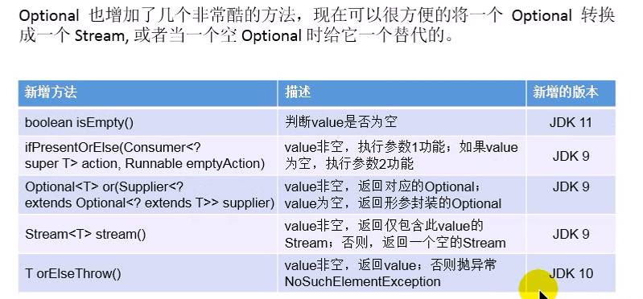
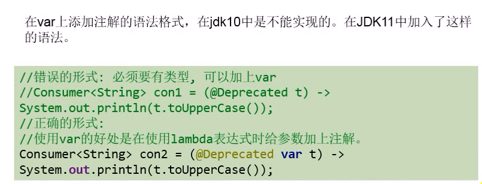
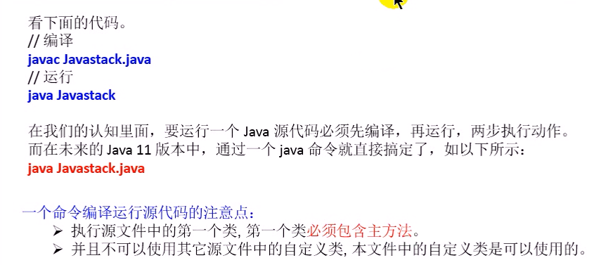

# Java11 新特性

# 1. String 新增方法

```java
		/**
         * isBlank 判断字符是否为空
         */
        System.out.println("   \t \n    ".isBlank());

        /**
         * strip 去除首位空格
         */
        System.out.println("------" + "   a\t \nb    ".strip() + "----");
        System.out.println("------" + "   a\t \nb    ".trim() + "----");

        // stripTrailing去除尾部空格
        System.out.println("------" + "   a\t \nb    ".stripTrailing() + "----");
        // stripLeading 去除头部空格
        System.out.println("------" + "   a\t \nb    ".stripLeading() + "----");

        String str = "abc";
        String str2 = str.repeat(5);
        System.out.println(str2);

        var str3 = "abc\ndfas\n";
        System.out.println(str3.lines().count());
```

# 2. Optional 的增强




```java
public class OptionalTest {
    public static void main(String[] args) {
        Optional<String> optional = Optional.of("");
        System.out.println(optional.isEmpty()); // false
        System.out.println(optional.isPresent()); // true
        optional = Optional.empty();
        System.out.println(optional.isEmpty()); // true
        System.out.println(optional.isPresent()); // false

        var obj = optional.orElseThrow();
        System.out.println(obj);
    }
}
```


# 3. 局部变量类型推断升级



# 4. 更简化的编译允许程序



# 5. 废弃Nashorn javascript 引擎


# 6. ZGC 