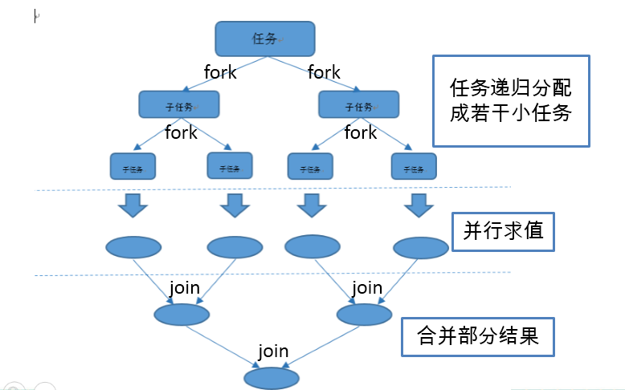

​	

                                           Java 8 新特性


# 1 Java 8 新特性简介

# 2 Lambda 表达式

目标：
什么是闭包？
Lambda表达式如何写？
什么是函数接口？
类型推断在Lambda中的体现。

## 2.1. 定义： 

```java
Lambda: In programming languages such as Lisp, Python and Ruby lambda is an operator used to denote anonymous functions or closures, following the usage of lambda calculus.

Lambda表达式为java添加了缺失的函数式编程特性， 使我们能将函数当做一等公民看， 在将函数作为一等公民的语言中， Lambda 表达式的类型是函数。 但是在java 中， Lambda表达式是对象， 他们必须依附于一类特别的对象类型---函数式接口（functional interface）。

lambda表达式是一段可以传递的代码，因为他可以被执行一次或多次。

在Java8之前传递代码并不是很容易，不可能将代码块到处传递。你不得不构建一个类的对象，由他的某个方法来包含所需的代码。而lambda表达式实际上就是代码块的传递的实现。
```


## 2.2. Lambda 表达式的作用 ： 

​    lambda表达式使代码变得简单，代替了匿名内部类传递行为， 而不仅仅是值， 提升抽象层次， API 重用性更	好， 更加灵活。

## 2.3. lambda表达式的语法

```java
由参数列表->函数体组成。函数体既可以是一个表达式，也可以是一个语句块，其语法结构如下：

(parameters) -> expression 或者 (parameters) -> {statements;}
括号里的参数可以省略其类型，编译器会根据上下文来推导参数的类型，你也可以显式地指定参数类型，如果没有参数，括号内可以为空。如果只有一个参数括号可以省略， 方法体如果只有一行功能语句则return语句和{}可以省略。

参数列表：方法体传入的参数
表达式：表达式会被执行然后返回执行结果。
语句块：语句块中的语句会被依次执行，就像方法中的语句一样，语句块使用{}括起来。
return语句会把控制权交给匿名方法的调用者
break和continue只能在循环中使用
如果函数体有返回值，那么函数体内部的每一条路径都必须返回值
表达式函数体适合小型lambda表达式，它消除了return关键字，使得语法更加简洁。

Lambda表达式的几种语法格式：
 a. Lambda表达式不包含参数，使用空括号 ()表示没有参数。
    （） -> System.out.println("hello world"); 
 b. 包含一个参数且主体为表达式 
    (x) -> x + 2;
 c. 包含多个参数且主体为表达式
    (x, y) -> x + y;
 d. 包含多个参数且主体为代码段
    (x, y) -> {
            if (x > y) {
                return x;
            } else {
                return y;
            }
        };
 e. 包含多个参数，指定参数类型且主体为代码段
    (int x, int y) -> x - y;
```
## 2.4. 引用值， 而不是变量

```java
 	在使用内部类时，我们总是碰到这种情况，需要引用内部类外面的变量，比如其所在方法内的变量，或者该类的全局变量。当使用方法内的变量时，需要将变量声明为final。此时将变量声明为final，意味着不能为其重复赋值，同时在匿名内部，实际上是用的使用赋给该变量的一个特定的值。
 	在Lambda表达式中，也是同样的问题，对于其方法体内引用的外部变量，在Lambda表达式所在方法内对变量再次赋值时，编译器会报同样的错误。也就是意味着，Lambda表达式引用的是值，而不是变量.这种行为也解释了为什么Lambda表达式也被称为闭包。未赋值的变量与周边环境隔离起来，进而被绑定到一个特定的值。在Java 8中引入了闭包这一概念，并将其使用在了Lambda表达式中。
 众说纷纭的计算机编程语言圈子里，Java是否拥有真正的闭包一直备受争议，因为在 Java中只能引用既成事实上的final变量。
```

## 2.5. 关于函数式接口：
```java
函数式接口是什么呢？函数式接口(Functional Interface)是Java 8对一类特殊类型的接口的称呼。这类接口只定义了唯一的抽象方法的接口（除了隐含的Object对象的公共方法），用作Lambda表达式的类型。

定义： 函数式接口（Functional Interface）是只包含一个抽象方法的接口，在Java 8中通过@FunctionalInterface注解，将一个接口标注为函数式接口，该接口只能包含一个抽象方法。@FunctionalInterface注解不是必须的，只要接口只包含一个抽象方法，虚拟机会自动判断该接口为函数式接口。
   
1. 如果一个接口只有一个抽象方法，那么该接口就是一个函数式接口
2. 如果我们在某个接口上声明了FunctionalInterface注解，那么编译器就会按照函数式接口定义来要求该接口
3. 如果某个接口只有一个抽象方法， 但是我们并没有给该接口声明FunctionalInterface注解，那么编译器依旧会将该接口看作是函数式接口

函数式接口是为Java 8中的lambda而设计的，lambda表达式的方法体其实就是函数接口的实现。

高阶函数： -高阶函数英文叫Higher-order function ，如果一个函数接受一个函数作为参数，或者返回一个函数作为返回值，这样的函数称为高阶函数
函数式编程就是指这种高度抽象的编程范式。

```

| 函数式接口          | 函数描述          | 原始类型特化                                                 |
| ------------------- | ----------------- | ------------------------------------------------------------ |
| Predicate           | T -> boolean      | IntPredicate, LongPredicate, DoublePredicate                 |
| Consumer            | T -> void         | IntConsumer, LongConsumer, DoubleConsumer                    |
| Function<T, R>      | T -> R            | IntFunction, IntToDoubleFunction, IntToLongFunction, LongFunction, LongToDoubleFunction, LongToIntFunction, DoubleFunction, ToIntFunction, ToDoubleFunction, ToLongFunction |
| Supplier            | () -> T           | BooleanSupplier, IntSupplier, LongSupplier, DoubleSupplier   |
| UnaryOperator       | T -> T            | IntUnaryOperator, LongUnaryOperator, DoubleUnaryOperator     |
| BinaryOperator      | (T, T) -> T       | IntBinaryOperator, LongBinaryOperator, DoubleBinaryOperator  |
| BiPredicate<L, R>   | (L, R) -> boolean |                                                              |
| BiConsumer<T, U>    | (T, U) -> void    | ObjIntConsumer, ObjLongConsumer, ObjDoubleConsumer           |
| BiFunction<T, U, R> | (T, U) -> R       | ToIntBiFunction<T, U>, ToLongBiFunction<T, U>, ToDoubleBiFunction<T, U> |

Lambda 及函数式接口的例子

| 使用案例              | Lambda 的例子                                                | 对应的函数式接口                                             |
| --------------------- | ------------------------------------------------------------ | ------------------------------------------------------------ |
| 布尔表达式            | (List list) -> list.isEmpty()                                | Predicate<List>                                              |
| 创建对象              | () -> new Apple(10)                                          | Supplier                                                     |
| 消费一个对象          | (Apple a) -> System.out.println(a.getWeight())               | Consumer                                                     |
| 从一个对象中选择/提取 | (String s) -> s.length()                                     | Function<String, Integer>, ToIntFunction                     |
| 合并两个值            | (int a, int b) -> a * b                                      | IntBinaryOperator                                            |
| 比较两个对象          | (Apple a1, Apple a2) -> a1.getWeight().compareTo(a2.getWeight()) | Comparator, BiFunction<Apple, Apple, Integer>, ToIntBiFunction<Apple, Apple> |


# 3 方法引用

```java
方法引用是lambda表达式的一种简写形式，如果lambda表达式只是调用一个特定的已经存在的方法，则可以使用方法引用。使用“::”操作符将方法名和对象或类的名字分隔开来。

方法引用一共分为四类：

１．　类名：：静态方法名
      classname::staticmethod // 方法应用的方式， 不需要传入任何参数
      classname.staticmethod // 原来的静态方法调用方式， 可传入参数
2. 引用名（对象名） :: 实例方法名

3. 类名::实例方法名

4. 构造方法引用： 类名::new
```
# 4 Stream API

## 4.1 Stream介绍

​		当处理集合时，通常会迭代所有元素并对其中的每一个进行处理。例如，我们希望统计一个字符串类型数组中，所有长度大于3的元素。

```
String[] strArr = { "Java8", "new", "feature", "Stream", "API" };
        int count = 0;
        for (String s : strArr) {
            if (s.length() > 3)
                count++;
        }
```

​		通常我们都会使用这段代码来统计，并没有什么错误，只是它很难被并行计算。这也是Java8引入大量操作符的原因，在Java8中，实现相同功能的操作符如下所示：

```
long count = Stream.of(strArr).filter(w -> w.length() > 3).count();
```

**stream**方法会为字符串列表生成一个**Stream**，**filter**方法会返回只包含字符串长度大于3的一个**Stream**，然后通过**count**方法计数。一个Stream表面上与一个集合很类似，允许你改变和获取数据，但实际上却有很大区别：

1. Stream自己**不会存储元素**。元素可能被存储在底层的集合中，或者根据需要产生出来。
2. Stream操作符**不会改变源对象**。相反，他们返回一个持有新结果的Stream。
3. Stream操作符可能是**延迟执行**的。意思是它们会等到需要结果的时候才执行。

Stream相对于循环操作有更好的可读性。并且可以并行计算：

```java
long count = Arrays.asList(strArr).parallelStream().filter(w -> w.length() > 3).count();
```

Stream遵循“**做什么，而不是怎么去做**”的原则。只需要描述需要做什么，而不用考虑程序是怎样实现的。

Stream很像Iterator，单向，只能遍历一遍。但是Stream可以只通过一行代码就实现多线程的并行计算。

集合讲的是数据， 流讲的是操作。

注意：

（1） Stream自己不会存储元素，

（2） Stream 不会改变源对象。相反， 他们会返回一个持有结果的新stream

（3） Stream 操作是延迟执行的。 这意味着他们会等到需要结果的时候才执行。


## 4.2 Stream-流的基本操作

使用Stream分为三个阶段：

### 4.2.1 获取流：我们有多种方式生成Stream

```java
// 通过Stream接口的静态工厂方法，of方法，其生成的Stream是有限长度的，Stream的长度为其内的元素个数。
Stream stream = Stream.of("hello", "world", "how", "are you");

// 数组的默认方法
String[] data = new String[]{"aaaaa", "bb bb", "ccccc", "dddd", "eeee"};
Stream stream1 = Arrays.stream(data);

// 通过Collection接口的默认方法获取流
List<String> list = Arrays.asList("aaaaa", "bb bb", "ccccc", "dddd", "eeee");
Stream stream2 = list.stream();

/** generator方法，返回一个无限长度的Stream,其元素由Supplier接口的提供。在Supplier是一个函数接口，只封装了一个get()方法，其用来返回任何泛型的值，该结果在不同的时间内，返回的可能相同也可能不相同，没有特殊的要求。
*/
Stream.generate(() -> 1);
Stream.iterate(0, i -> i + 1); // 无限流

// empty方法返回一个空的顺序Stream，该Stream里面不包含元素项。
Stream.empty();
```

### 4.2.2 一系列的中间操作

 筛选,切片, 映射, 排序

```java
/**
     * 筛选与切片
     * filter --接收Lambda, 从流中排除某些元素
     * limit -- 截断流， 使其元素不超过给定数量
     * skip（n）-- 跳过元素， 返回一个扔掉了前n个元素的流。 若流中元素不足n 个，则返回一个空流。 与        * limit（n）互补
     * distinct--筛选 ， 通过流生成的hashcode（） 和equals（）去除重复元素
     *
     */
    @Test
    public void test1() {
        // 筛选年龄大于35的
        students.stream().filter(s -> s.getAge() > 35).forEach(System.out::println); 
        System.out.println("-----");
        students.stream().limit(3).forEach(System.out::println); // 取前3个元素
        System.out.println("-----");
        students.stream().skip(3).forEach(System.out::println); // 跳过前3个元素
        System.out.println("-----");
        students.stream().distinct().forEach(System.out::println); // 剔除重复项
    }
```


```java
**
 * 映射
 * map--接受Lambda, 将元素转换成其他形式或提取信息.接受一个函数作为参数， 该函数会被应用到每个元素上，  * 并将其映射成一个新的元素。
 * flatMap--接收一个函数作为参数，将流中的每个值都换成另一个流， 然后把所有流连接成一个流
 * 将多个Stream连接成一个Stream，这时候不是用新值取代Stream的值，与map有所区别，这是重新生成一个  *  * Stream对象取而代之。
 *
 */
@Test
public  void test5() {
    List<String> list = Arrays.asList("aaaa", "bbb", "ccc", "ddd", "eeee", "gggg");
    list.stream().map((str) -> str.toUpperCase()).forEach(System.out::println);
    System.out.println("------------------");
    // map返回一个新的stream, 这里结果是原Stream 中包含map 返回的一个新流
	Stream<Stream<Character>> stream = list.stream().map(StreamAPITest::filterCharacter);
	// flatMap 把所有流合成为一个流并返回，最终得到一个新的流
    Stream<Character> stream1 = list.stream().flatMap(StreamAPITest::filterCharacter);
}

public static Stream<Character> filterCharacter(String str ) {
    List<Character> list = new ArrayList<>();
    for (Character c : str.toCharArray()) {
        list.add(c);
    }
    return list.stream();
}
```

```java
/**
* 排序
* sorted() -- 自然排序Comparable
* sorted(Comparator com) -- 定制排序
*/
@Test
public void test6() {
    List<String> list = Arrays.asList("hello", "world", "hi", "welcome", "");
    list.stream().sorted().forEach(System.out::println);

    System.out.println("--------------");
    students.stream().sorted((s1, s2) -> {
        if(s1.getAge() == s2.getAge()) {
            return s1.getName().compareTo(s2.getName());
        } else {
            return s1.getAge() - s2.getAge();
        }
    });
}
```


### 4.2.3 终止操作

```java
/**
     * 查找与匹配
     * allMatch--检查是否匹配所有元素
     * anyMatch-- 检查是否至少匹配一个元素
     * noneMatch--检查是否没有匹配所有元素
     * findFirst--返回第一个元素
     * findAny--返回流中的任意一个元素
     * count--返回流中元素个数的总和
     * max--返回流中最大值
     * min--返回流中最小值
     *
     */
    @Test
    public void test() {
        boolean allMatch = students.stream()
            	.allMatch(s -> s.getStatus().equals(Student.Status.BUSY));
        System.out.println(allMatch);
        System.out.println("-----------");
        boolean anyMatch = students.stream()
            .anyMatch(s -> s.getStatus().equals(Student.Status.BUSY));
        System.out.println(anyMatch);
        System.out.println("----------------");
        boolean noneMatch = students.stream()
            .noneMatch(s -> s.getStatus().equals(Student.Status.BUSY));
        System.out.println(noneMatch);
        System.out.println("----------");
        Optional<Student> optional = students.stream()
            .sorted(Comparator.comparingInt(Student::getScore))
            .findFirst();
        optional.ifPresent(System.out::println);
        System.out.println("---------------");
        Optional<Student> op = students.parallelStream()
            .filter(s1 -> s1.getStatus().equals(Student.Status.FREE))
            .findAny();
        op.ifPresent(System.out::println);

        long count = students.stream().count();
        System.out.println(count);
        System.out.println("--------------");
        Optional<Student> max = students.stream()
            .max(Comparator.comparingInt(Student::getScore));
        max.ifPresent(System.out::println);
        System.out.println("-------------------");
        Optional<Integer> min = students.stream()
            .map(Student::getScore)
            .min(Integer::compare);
        min.ifPresent(System.out::println);
        System.out.println("-------------------");
    }
```


```java
/**
     * 归约reduce
     * reduce(T identity, BinaryOperator operator) / reduce(BinaryOperator operator)
     * --可以将流中元素反复结合起来得到一个新值
     */
    @Test
    public void test2() {
        List<Integer> list = Arrays.asList(1, 2, 3, 4, 5, 6, 7, 8, 9, 10);
        Integer sum = list.stream().reduce(0, Integer::sum);
        System.out.println(sum);
        
        System.out.println("-------------");
        // map和reduce 通常称为map-reduce模式， 因google用它进行网络搜索而出名
        Optional<Integer> total = students.stream()
            .map(s -> s.getScore()).reduce(Integer::sum);
        System.out.println(total.get());
        System.out.println("-------------");
    }

/**
* 收集
* collect--将流转换为其他形式。 接受一个collector接口的实现， 用于给stream中元素做汇总的方法
*
*/
@Test
public void test3() {
// 获取名字
List<String> names = students.stream().map(s -> s.getName()).collect(Collectors.toList());
System.out.println(names);

//总数
Long count = students.stream().collect(Collectors.counting());
System.out.println(count);

// 平均成绩
Double avg = students.stream().collect(Collectors.averagingDouble(Student::getScore));
System.out.println(avg);

// 成绩总和
Double total = students.stream().collect(Collectors.summingDouble(Student::getScore));
System.out.println(total);

// 最大成绩
Optional<Student> max = students.stream().collect(Collectors.maxBy(Comparator.comparingInt(Student::getScore)));
max.ifPresent(System.out::println);

// 分组
Map<Student.Status, List<Student>> map = students.stream().collect(Collectors.groupingBy(Student::getStatus));
for (Map.Entry<Student.Status, List<Student>> entry: map.entrySet()) {
    System.out.println(entry.getKey());
    System.out.println(entry.getValue());
}

Map<Student.Status, Map<String, List<Student>>> map2 = students.stream()
        .collect(Collectors.groupingBy(Student::getStatus, Collectors.groupingBy( 	(Student s) -> {
            if(s.getAge() <= 35) {
                return "青年";
            } else if(s.getAge() <= 50) {
                return "中年";
            } else {
                return "老年";
            }
        })));

System.out.println(map2);
}

// 分区
Map<Boolean , List<Student>> partitioning = students.stream().collect(Collectors.partitioningBy((Student s) -> {
    if(s.getScore() < 60) {
        return false;
    } else {
        return true;
    }
})); 
System.out.println(partitioning);

// 组函数
DoubleSummaryStatistics summaryStatistics = students.stream().
    collect(Collectors.summarizingDouble(Student::getScore));
System.out.println(summaryStatistics.getMax());
System.out.println(summaryStatistics.getAverage());
System.out.println(summaryStatistics.getCount());
System.out.println(summaryStatistics.getMin());
System.out.println(summaryStatistics.getSum());
```


### 4.2.4 内部迭代和外部迭代

```java
@Test
    public void test2() {
        //内部迭代： 迭代操作由Stream API 完成
        // 中间操作: 不会执行任何操作
        Stream<Student> stream = students.stream().filter((e) -> {
            System.out.println("Stream API 的中间操作");
            return e.getAge() > 35;
        });
        // 终止操作: 一次性执行全部内容, 即惰性求值
        stream.forEach(System.out::println);
    }

    @Test
    public void test3() {
        // 外部迭代
        Iterator<Student> it = students.iterator();
        while(it.hasNext()) {
            System.out.println(it.next());
        }
    }
```


## 4.3 Fork/Join

Fork/Join 框架: 就是在必要的情况下，将一个大任务，进行拆分（fork）成若干个小任务（拆到不可再拆时）， 再将一个个小任务运算的结果进行join汇总。




## 4.4 stream/parallelstream


parallel 并行流操作时，jdk默认生成cpu核心数的线程数目

拓展： 如果计算机是4核心cpu， 某些情况下Intel会通过超线程技术，将cpu实现为8核心，所以最终当执行parallel并行流操作时， 默认生成8个线程。具体可以通过如下代码来查看当前机器的内核数量：

```java
System.out.println(Runtime.getRuntime().availableProcessors());
```


## 4.5 comparator 比较器    

```java
list.stream().sorted(Comparator.comparing((String x) -> x.length()).reversed()).forEach(System.out::println);

提问： 为什么编译器这里不能推断出x的数据类型？？？
答案： .reversed() 返回一个新的Comparator给sort 接口，类型为泛型T, 基于Comparator.comparing((String x) -> x.length()), 
但是该方法参数为？ super T, 且离上下文stream 环境太远， JVM无法推断出对应的数据类型， 需要显式声明

list.stream().sorted(Comparator.comparing(x -> x.length())).forEach(System.out::println);
提问： 此刻为什么不需要类型推断呢？

thenComparing，　只有当前一个比较器比较结果相等的时候才会去执行thenComparing的比较，　
换句话说，当第一个比较器已经能确定比较顺序的时候，不需要去执行第二个比较器
```


## 4.6 collect/collector 源码解析


流本身不存储值， 通过管道的方式获取值
本质是函数式的， 对流的操作会生成一个结果， 不过并不会修改底层的数据源，集合可以作为流的底层数据源
延迟查找，很多流查找（过滤，映射， 排序等） 都可以延迟实现。

map - flatmap
map - reduce
collectors
无限流，

IntStream.iterate(0, i -> (i + 1) % 2).distinct().limit(6).forEach(System.out::println); // 无限流， 程序一直运行，不会退出
IntStream.iterate(0, i -> (i + 1) % 2).limit(6).distinct().forEach(System.out::println); // 程序被限制为取6个元素， 程序会正常结束

内部迭代和外部迭代

集合关注的是数据与数据存储本身
流关注的则是对数据的计算
流与迭代器类似的一点事： 流是无法重复使用或消费的。

中间操作都会返回一个Stream 对象，比如说返回Stream<Student>, Stream<Integer>, Stream<String> ...
终止操作都不会返回Stream对象。可能不返回值, 也可能返回其他类型的的单个值, 例如，min，max，count， reduce.....

区分中间操作还是终止操作的主要判断依据就是看返回值类型，如果是Stream 类型的，那必定是中间操作。


当结果容器和中间容器一直的时候，ｆｉｎｉｓｈｅｒ方法不被执行，程序直接返回中间容器类型

当Characteristics.CONCURRENT时， combiner 的lambda表达式不会被执行，因为当并行操作时，中间结果容器只有一个实例，
所以combiner 不需要去合并中间结果。
当Characteristics不是CONCURRENT时， 中间结果容器会有多个结果，此时需要执行combiner中的lamdba表达式去合并中间结果集


combiner 串行时候不会被调用， 并行并且不存在CONCURRENT枚举值的时候才会被调用

```java


/**
* collect 接口的底层实现
*/
public final <R, A> R collect(Collector<? super P_OUT, A, R> collector) {
        A container;
        if (isParallel()
                && (collector.characteristics().contains(Collector.Characteristics.CONCURRENT))
                && (!isOrdered() || collector.characteristics().contains(Collector.Characteristics.UNORDERED))) {
            container = collector.supplier().get();
            BiConsumer<A, ? super P_OUT> accumulator = collector.accumulator();
            forEach(u -> accumulator.accept(container, u));
        }
        else {
            container = evaluate(ReduceOps.makeRef(collector));
        }
        return collector.characteristics().contains(Collector.Characteristics.IDENTITY_FINISH)
               ? (R) container
               : collector.finisher().apply(container);
    }


```
```java
enum Characteristics {
        /**
         * Indicates that this collector is <em>concurrent</em>, meaning that
         * the result container can support the accumulator function being
         * called concurrently with the same result container from multiple
         * threads.
         *
         * <p>If a {@code CONCURRENT} collector is not also {@code UNORDERED},
         * then it should only be evaluated concurrently if applied to an
         * unordered data source.
         * 如果一个收集器是CONCURRENT的话，那么中间结果容器只会有一个，多个线程会同时操作这个中间容器，  		 * 如果不标记为CONCURRENT，那么有多少个线程中间结果容器就会执行多少次，然后再进行combiner合并
         */
        CONCURRENT,

        /**
         * Indicates that the collection operation does not commit to preserving
         * the encounter order of input elements.  (This might be true if the
         * result container has no intrinsic order, such as a {@link Set}.)
         * 如果数据源是无序的那么就需要将之定义为UNORDERED, 否则不应该定义该特性
         */
        UNORDERED,

        /**
         * Indicates that the finisher function is the identity function and
         * can be elided.  If set, it must be the case that an unchecked cast
         * from A to R will succeed.
         * 当collector 标记为IDENTITY_FINISH时候， finisher方法不会被执行，即程序会直接对中间类型			 * 进行一次强制转换成R类型，而不会去调用finisher方法。否则会调用finisher方法
         *
         *    	collector.characteristics().
         *    	contains(Collector.Characteristics.IDENTITY_FINISH)
         *      ? (R) container
         *      : collector.finisher().apply(container);
         */
        IDENTITY_FINISH
    }
```

收集器：

对于Collectors静态工厂类来说， 其实现一共分为两种情况：

	1. 通过CollectorImpl来实现
 	2. 通过reducing方法来实现；reducing方法本身又是通过CollectorImpl实现的。
 	3. 


## 4.7 Collectors.groupingby 源码解析

```java
/**
     * Returns a {@code Collector} implementing a "group by" operation on
     * input elements of type {@code T}, grouping elements according to a
     * classification function, and returning the results in a {@code Map}.
     *
     * <p>The classification function maps elements to some key type {@code K}.
     * The collector produces a {@code Map<K, List<T>>} whose keys are the
     * values resulting from applying the classification function to the input
     * elements, and whose corresponding values are {@code List}s containing the
     * input elements which map to the associated key under the classification
     * function.
     *
     * <p>There are no guarantees on the type, mutability, serializability, or
     * thread-safety of the {@code Map} or {@code List} objects returned.
     * @implSpec
     * This produces a result similar to:
     * <pre>{@code
     *     groupingBy(classifier, toList());
     * }</pre>
     *
     * @implNote
     * The returned {@code Collector} is not concurrent.  For parallel stream
     * pipelines, the {@code combiner} function operates by merging the keys
     * from one map into another, which can be an expensive operation.  If
     * preservation of the order in which elements appear in the resulting {@code Map}
     * collector is not required, using {@link #groupingByConcurrent(Function)}
     * may offer better parallel performance.
     *
     * @param <T> the type of the input elements
     * @param <K> the type of the keys
     * @param classifier the classifier function mapping input elements to keys
     * @return a {@code Collector} implementing the group-by operation
     *
     * @see #groupingBy(Function, Collector)
     * @see #groupingBy(Function, Supplier, Collector)
     * @see #groupingByConcurrent(Function)
     */
    public static <T, K> Collector<T, ?, Map<K, List<T>>>
    groupingBy(Function<? super T, ? extends K> classifier) {
        return groupingBy(classifier, toList());
    }
```


# 5 Optional容器类

```java
Optional 没有序列化，　不要将optional 作为参数或者成员变量来使用
Optional value-based 没有公有的构造器方法，只有私有的构造器。

Optional<T> 类(java.util.Optional) 是一个容器类，代表一个值存在或不存在，原来用null 表示一个值不存在，现在Optional 可以更好的表达这个概念。并且可以避免空指针异常。
常用方法：
Optional.of(T t) : 创建一个Optional 实例
Optional.empty() : 创建一个空的Optional 实例
Optional.ofNullable(T t):若t 不为null,创建Optional 实例,否则创建空实例
isPresent() : 判断是否包含值
orElse(T t) : 如果调用对象包含值，返回该值，否则返回t
orElseGet(Supplier s) :如果调用对象包含值，返回该值，否则返回s 获取的值
map(Function f): 如果有值对其处理，并返回处理后的Optional，否则返回Optional.empty()
    // map中获取的返回值自动被Optional包装,即返回值 -> Optional<返回值>
    optional.map(x -> x + "test")
flatMap(Function mapper):与map 类似，要求返回值必须是Optional
	// flatMap中返回值保持不变,但必须是Optional类型,即Optional<返回值> -> Optional<返回值>
	optional.flatMap(x -> Optional.of(x + "test"))
```


​    

# 6 接口中的默认方法和静态方法

## 6.1. 介绍

```java
在Java8以前，接口中只能有抽象方法(public abstract 修饰的方法)跟全局静态常量(public static final 常量  )；
但是在Java8中，允许接口中包含具有具体实现的方法，该方法称为 “默认方法”，默认方法使用 default 关键字修饰，例如：
public interface Person {
    //默认方法
    default String getName(String name) {
        return name;
    }
}
其次，Java8中，接口中还允许添加静态方法。

默认方法和静态方法使Java的功能更加丰富。在Java 8中Collection接口中就添加了四个默认方法，stream()、parallelStream()、forEach()和removeIf()。Comparator接口也增加了许多默认方法和静态方法。
```

## 6.2. 接口中的默认方法

    第一种情况：接口默认方法的”类优先”原则         
        若一个接口中定义了一个默认方法，而另外一个父类或接口中 又定义了一个同名的方法时，先调用类中的同名方法
       
    第二种情况： 接口冲突。
        如果一个父接口提供一个默认方法，而另一个接口也提供了一个具有相同名称和参数列表的方法（不管方法 是否是默认方法），那么必须覆盖该方法来解决冲突，
       （接口中是可以多实现的）
        如果一个类实现多个接口。并且这些接口提供了一个具有相同名称和参数列表的方法（不管方法 是否是默认方法），那么必须覆盖该方法来解决冲突。子类必须指定覆盖哪个父类接口中的方法。

## 6.3. 接口中的静态方法

    静态方法就像一个普通Java静态方法，但方法的权限修饰只能是public或者不写。
    调用方式：接口名.方法名();


​    
# 7 新时间日期API

    Joda Time 第三方时间日期API， 相较于jdk1.7 和之前的日期API， 提供了很多实用的接口和功能， 导致于很少有人实用jdk 自身的日期API，
    从JDK1.8开始， 全新设计的时间日期API， 类似于Joda Time, 提供了很多实用的接口函数。
    
    传统的时间 API 存在线程安全的问题，在多线程开发中必须要上锁，所以 java8 现在为我们提供了一套全新的时间日期 API，
    新的日期API每次改变都是一个新的实例，每个实例都是不可变的，所以新的日期API 是线程安全的

## 7.1. 使用 LocalDate、LocalTime、LocalDateTime

    LocalDate、LocalTime、LocalDateTime类的实例是不可变的对象，分别表示使用 ISO-8601 （ISO-8601 日历系统是国际化组织制定的现代化
    公民的日期和时间的表达法）日历系统的日期、时间、日期和时间。它们提供了简单的日期或时间，并不包含当前时间的时间信息。
    也不包含与时区相关的信息。
    
    LocalDate LocalTime LocalDateTime 三个类的使用方式一样，只是代表的含义不同而已。

## 7.2. 使用 Instant ： 时间戳（以Unix 元年 ： 1970-01-01 00：00：00 到某个时间之间的毫秒数）


## 7.3. Duration 计算两个时间之间的间隔   

## 7.4. Period 计算两个日期之间的间隔

## 7.5. 时间校正器

## 7.6. 时间、日期格式化 DateTimeFormatter

### 7.6.1 时间转字符串
### 7.6.2 字符串转时间

# 8 重复注解和类型注解
    Java 8对注解处理提供了两点改进：可重复的注解及可用于类型的注解。

