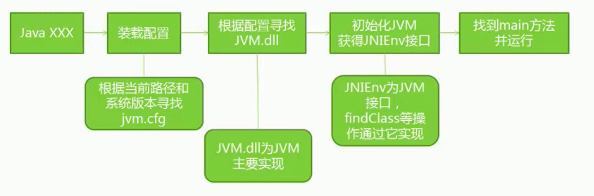
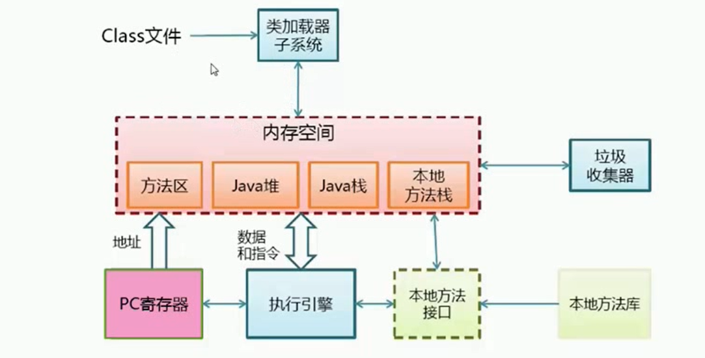
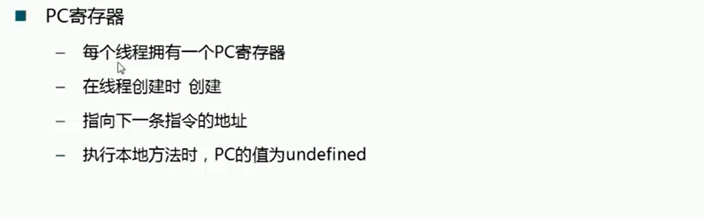
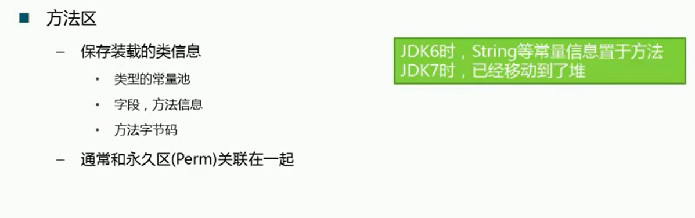

# 								JVM

# 1. JVM 规范

## 1.1 Java语言规范和JVM规范

Java 元类型：byte， short， int long， float， char

变量初始值：

boolean false;
char \u0000

Java语言规范定义了什么是java 语言， JVM则主要定义了二进制class文件和JVM指令集等。 Java语言和JVM相对独立。即只要符合JVM规范的语言都可以在JVM中运行， 例如JAVA， Groovy， Clojure, Scala等。

## 1.2 JVM 规范主要内容：

-- Class 文件格式

-- 数字的内部表示和存储 - Byte -128 to 127 

-- return Address数据类型定义

-- 指向操作码的指针。 不对应Java数据类型，不能在运行时修改， finally实现需要。

-- 定义PC

--堆

--栈

--方法区

## 1.3  整数的表达：整数32位

-原码： 第一位为符号位（0为正数， 1为负数）

-反码： 符号位不动， 原码取反

-负数补码： 符号位不动 反码加1

-正数补码： 和原码相同

打印整数的二进制, 在计算机中都是使用补码来表示， 

**为什么使用补码？使用补码有什么好处?**

0 用补码来表示的时候，无论+0 还是-0 ， 最终结果补码都是一样的00000000： 

使用补码做运算非常方便， 2个补码直接相加，符号位参加运算, 等到的结果就是正确的结果。

float 的表示和定义： 单精度浮点32， 双精度浮点64位

-- 支持IEEE 754 

s  eeeeeeee mmmmmmmmmmmmmmmmmmmmmmm

s 符号位

8位e表示 指数

尾数23 位

e全0 尾数附加为为0, 否则尾数附加位为1， 所以说，虽然尾数为23位，但是实际上它表达了24位，因为通过8位e来推导出尾数附加位来表示。

sXmX2^(e-127)

例子：-5

1 10000001 01000000000000000000000

-1X2^(129-127)*(2^0+2^-2)  = -5

一些特殊的方法：

-- <Clinit>

-- <init>  楼的无参构造函数

## 1.4 VM 指令集

-- 类型转化 l2i

-- 出入栈操作 aload  astore

-- 运算 iadd  isub

--流程控制 ifreq ifine

--函数调用 invokevirtual invokeinterface invokespecial invokestatic

# 1.5 JVM 需要对Java Libary 提供以下支持

--反射 java.lang.refelct

--ClassLoader

--初始化class和interface

--安全相关的java.security

--多线程

--弱引用

# 1.6 JVM 的编译：

--源码到JVM指令的对应格式

-javap

--JVM 反汇编的格式

<index><opcode>[<operand1>[<operand2>....]] [<comment>]

```java
void spin() {
        int i;
        for(i = 0; i< 100; i++) {
            // Loop body is empty
        }
    }
    0 iconst_0 // Push int constant 0
    1 istore_1 // Store into local variable 1 (i = 0)
    2 goto 8  // First time through don't increment
    5 iinc 1 1 // Increment local variable 1 by (i++)
    8 iload_1 // Push local variable 1 (i)
    9 bipush 100 // Push int constant 100
    11 if_icmplt 5 // Compare and loop if less than (i < 100)
    14 return  // Return void when done 
```


# 2. JVM 运行机制

## 2.1 JVM启动流程



## 2.2 JVM基本结构










## 2.3 内存模型

## 2.4 编译和解释运行的概念

