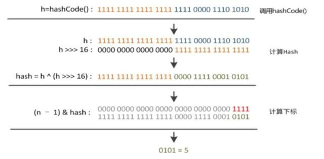
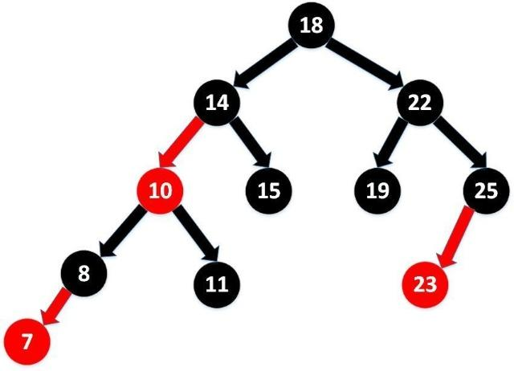

														**JAVA 常见知识点总结**

# 1.集合

## 1.1 HashMap

### 1.1.1 为什么用HashMap ?

- HashMap是一个散列桶（数组和链表），它存储的内容是键值对(key-value)映射
- HashMap采用了数组和链表的数据结构，能在查询和修改方便继承了数组的线性查找和链表的寻址修改
- HashMap是非synchronized，所以HashMap很快
- HashMap可以接受null键和值，而Hashtable则不能（原因就是equlas()方法需要对象，因为HashMap是后出的API经过处理才可以）

### 1.1.2 HashMap的工作原理是什么？

- HashMap是基于hashing的原理，我们使用put(key, value)存储对象到HashMap中，使用get(key)从HashMap中获取对象。当我们给put()方法传递键和值时，我们先对键调用hashCode()方法，计算并返回的hashCode是用于找到Map数组的bucket位置来储存Node 对象。这里关键点在于指出，HashMap是在bucket中储存键对象和值对象，作为Map.Node 。


- 以下是HashMap初始化 ，简单模拟数据结构

Node[] table=new Node[16];  // 散列桶初始化，t

Tableclass Node {

​		hash; //hash值 

​		key; //键　

​		value; /值　

​		node next; //用于指向链表的下一层（产生冲突，用拉链法）

​	}

- 以下是具体的put过程（JDK1.8版）

1、对Key求Hash值，然后再计算下标

2、如果没有碰撞，直接放入桶中（碰撞的意思是计算得到的Hash值相同，需要放到同一个bucket中）

3、如果碰撞了，以链表的方式链接到后面

4、如果链表长度超过阀值( TREEIFY THRESHOLD==8)，就把链表转成红黑树，链表长度低于6，就把红黑树转回链表

5、如果节点已经存在就替换旧值

6、如果桶满了(容量16*加载因子0.75)，就需要 resize（扩容2倍后重排）

以下是具体get过程(考虑特殊情况如果两个键的hashcode相同，你如何获取值对象？)当我们调用get()方法，HashMap会使用键对象的hashcode找到bucket位置，找到bucket位置之后，会调用keys.equals()方法去找到链表中正确的节点，最终找到要找的值对象。


### 1.1.3 有什么方法可以减少碰撞？

- 扰动函数可以减少碰撞，原理是如果两个不相等的对象返回不同的hashcode的话，那么碰撞的几率就会小些，这就意味着存链表结构减小，这样取值的话就不会频繁调用equal方法，这样就能提高HashMap的性能。（扰动即Hash方法内部的算法实现，目的是让不同对象返回不同hashcode。）
- 使用不可变的、声明作final的对象，并且采用合适的equals()和hashCode()方法的话，将会减少碰撞的发生。不可变性使得能够缓存不同键的hashcode，这将提高整个获取对象的速度，使用String，Interger这样的wrapper类作为键是非常好的选择。为什么String, Interger这样的wrapper类适合作为键？因为String是final的，而且已经重写了equals()和hashCode()方法了。不可变性是必要的，因为为了要计算hashCode()，就要防止键值改变，如果键值在放入时和获取时返回不同的hashcode的话，那么就不能从HashMap中找到你想要的对象。


### 1.1.4 HashMap中hash函数怎么是是实现的?

我们可以看到在hashmap中要找到某个元素，需要根据key的hash值来求得对应数组中的位置。如何计算这个位置就是hash算法。前面说过hashmap的数据结构是数组和链表的结合，所以我们当然希望这个hashmap里面的元素位置尽量的分布均匀些，尽量使得每个位置上的元素数量只有一个，那么当我们用hash算法求得这个位置的时候，马上就可以知道对应位置的元素就是我们要的，而不用再去遍历链表。 所以我们首先想到的就是把hashcode对数组长度取模运算，这样一来，元素的分布相对来说是比较均匀的。但是，“模”运算的消耗还是比较大的，能不能找一种更快速，消耗更小的方式，我们来看看JDK1.8的源码是怎么做的（被楼主修饰了一下）

```java
/**
     * Computes key.hashCode() and spreads (XORs) higher bits of hash
     * to lower.  Because the table uses power-of-two masking, sets of
     * hashes that vary only in bits above the current mask will
     * always collide. (Among known examples are sets of Float keys
     * holding consecutive whole numbers in small tables.)  So we
     * apply a transform that spreads the impact of higher bits
     * downward. There is a tradeoff between speed, utility, and
     * quality of bit-spreading. Because many common sets of hashes
     * are already reasonably distributed (so don't benefit from
     * spreading), and because we use trees to handle large sets of
     * collisions in bins, we just XOR some shifted bits in the
     * cheapest possible way to reduce systematic lossage, as well as
     * to incorporate impact of the highest bits that would otherwise
     * never be used in index calculations because of table bounds.
     */
    static final int hash(Object key) {
        int h;
        return (key == null) ? 0 : (h = key.hashCode()) ^ (h >>> 16);
    }

	//key.hasCode() 返回散列值也就是hashcode 
	// ^ 按位异或
	// >>> 无符号右移，忽略符号位，空位都以0补齐
	// 其中n是数组的长度，即Map的数组部分初始化长度
	// return (n-1)&(h ^ (h >>> 16));
```



简单来说就是

1. 高16bt不变，低16bit和高16bit做了一个异或(得到的HASHCODE转化为32位的二进制，前16位和后16位低16bit和高16bit做了一个异或)

2. (n·1)&hash=->得到下标

### 1.1.5 拉链法导致的链表过深问题为什么不用二叉查找树代替，而选择红黑树？为什么不一直使用红黑树？

之所以选择红黑树是为了解决二叉查找树的缺陷，二叉查找树在特殊情况下会变成一条线性结构（这就跟原来使用链表结构一样了，造成很深的问题），遍历查找会非常慢。而红黑树在插入新数据后可能需要通过左旋，右旋、变色这些操作来保持平衡，引入红黑树就是为了查找数据快，解决链表查询深度的问题，我们知道红黑树属于平衡二叉树，但是为了保持“平衡”是需要付出代价的，但是该代价所损耗的资源要比遍历线性链表要少，所以当长度大于8的时候，会使用红黑树，如果链表长度很短的话，根本不需要引入红黑树，引入反而会慢。


### 1.1.6 说说你对红黑树的见解？



- 1、每个节点非红即黑
- 2、根节点总是黑色的
- 3、如果节点是红色的，则它的子节点必须是黑色的（反之不一定）
- 4、每个叶子节点都是黑色的空节点（NIL节点）
- 5、从根节点到叶节点或空子节点的每条路径，必须包含相同数目的黑色节点（即相同的黑色高度）

### 1.1.7 解决hash 碰撞还有那些办法？

- 开放定址法。

  当冲突发生时，使用某种探查技术在散列表中形成一个探查(测)序列。沿此序列逐个单元地查找，直到找到给定的地址。

  按照形成探查序列的方法不同，可将开放定址法区分为线性探查法、二次探查法、双重散列法等。

  下面给一个线性探查法的例子　　

  问题：已知一组关键字为(26，36，41，38，44，15，68，12，06，51)，用除余法构造散列函数，用线性探查法解决冲突构造这组关键字的散列表。

  解答：为了减少冲突，通常令装填因子α由除余法因子是13的散列函数计算出的上述关键字序列的散列地址为(0，10，2，12，5，2，3，12，6，12)。

  前5个关键字插入时，其相应的地址均为开放地址，故将它们直接插入T[0]，T[10)，T[2]，T[12]和T[5]中。

  当插入第6个关键字15时，其散列地址2(即h(15)=15％13=2)已被关键字41(15和41互为同义词)占用。故探查h1=(2+1)％13=3，此地址开放，所以将15放入T[3]中。

  当插入第7个关键字68时，其散列地址3已被非同义词15先占用，故将其插入到T[4]中。

  插入第8个关键字12时，散列地址12已被同义词38占用，故探查hl=(12+1)％13=0，而T[0]亦被26占用，再探查h2=(12+2)％13=1，此地址开放，可将12插入其中。

  类似地，第9个关键字06直接插入T[6]中；而最后一个关键字51插人时，因探查的地址12，0，1，…，6均非空，故51插入T[7]中。

### 1.1.8 如果HashMap的大小超过了负载因子(load factor)定义的容量，怎么办？

默认的负载因子大小为0.75，也就是说，当一个map填满了75%的bucket时候，和其它集合类(如ArrayList等)一样，将会创建原来HashMap大小的两倍的bucket数组，来重新调整map的大小，并将原来的对象放入新的bucket数组中。这个过程叫作rehashing，因为它调用hash方法找到新的bucket位置。这个值只可能在两个地方，一个是原下标的位置，另一种是在下标为<原下标+原容量>的位置

### 1.1.9 重新调整HashMap大小存在什么问题吗？

当重新调整HashMap大小的时候，确实存在条件竞争，因为如果两个线程都发现HashMap需要重新调整大小了，它们会同时试着调整大小。在调整大小的过程中，存储在链表中的元素的次序会反过来，因为移动到新的bucket位置的时候，HashMap并不会将元素放在链表的尾部，而是放在头部，这是为了避免尾部遍历(tail traversing)。如果条件竞争发生了，那么就死循环了。(多线程的环境下不使用HashMap）

为什么多线程会导致死循环，它是怎么发生的？HashMap的容量是有限的。当经过多次元素插入，使得HashMap达到一定饱和度时，Key映射位置发生冲突的几率会逐渐提高。这时候，HashMap需要扩展它的长度，也就是进行Resize。

​			1.扩容：创建一个新的Entry空数组，长度是原数组的2倍。

​			2.ReHash：遍历原Entry数组，把所有的Entry重新Hash到新数组。


初始化ｓｉｚｅ，　会根据算法去算，　最终结果都是2^n
２．初始化在ｐｕｔ　时候才会进行初始化，ｎｅｗ　ｈａｓｈｍａｐ　的时候不会进行初始化，
３．当ｈａｓｈ　ｃｏｄｅ　散列到同一个ｎｏｄｅ　的时候，首先生成链表，当链表数量达到８的时候，将链表变为红黑树，　当红黑树数据缩小到６的时候，再改回链表
４．　树，　红黑树，　平衡树，　完全平衡树，　Ｂ＋树
５．　ｃｏｎｒｒｅｎｔｈａｓｐ　ｍａｐ　JDK 1.7 和JDL1.8之间的异同
６．　ＬｉｎｋｅｄHashMap  有序的，　LRC 缓存

Ｌｉｎｋｅｄ hashmap  --> ＬＲＣ　缓存

ｌｉｓｔ: 满了后，直接　扩容５０％每次
随机访问

arraylist, linkedarraylist 区别

copyonrightArryList

LinkedArrayList　应用场景

Set, treeSet