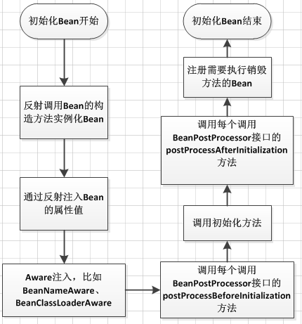

# Spring 注解驱动开发

Spring5 是一个重要的版本，距离SpringFramework4差不多四年。在此期间，大多数增强都是在 SpringBoot 项目中完成的。在本文中，我们将很快了解到Spring5发行版中的一些令人兴奋的特性。

\1. 基准升级

要构建和运行 Spring5 应用程序，你至少需要 J2EE7 和 JDK8。以前的 JDK 和 JavaEE 版本不再支持。 JavaEE7 包含：

- Servlet 3.1
- JMS 2.0
- JPA 2.1
- JAX-RS 2.0
- Bean Validation 1.1

与 Java 基准类似，许多其他框架的基准也有变化。例如：

- Hibernate 5
- Jackson 2.6
- EhCache 2.10
- JUnit 5
- Tiles 3

另外，请记下各种服务器最低支持版本。

- Tomcat 8.5+
- Jetty 9.4+
- WildFly 10+
- Netty 4.1+
- Undertow 1.4+

\2. 兼容 JDK9 运行时

Spring5 发行版与 JDK9 发行日期非常接近。目标是让 Spring Framework5 在 JDK9 的 GA 之后正确运行。 Spring5 版本的候选版本已经在 classpath 和 modulepath 上支持 Java9 了。

GA版本中你可以期待良好的 JDK9 支持。

\3. 使用 JDK8 特性

获取免费Spring 5 新特性视频详解可以群：554355695

在 Spring4.3 之前，JDK基准版本是6。所以 Spring4 必须支持 Java6,7 和8，为了保持向后兼容性， Spring 框架没有适应 Java8 带来的许多新特性，比如 lambda 表达式。

Spring5 的基准版本为8，因此它使用了 Java8 和9的许多新特性。例如：

- Spring 接口中的默认方法
- 基于 Java8 反射增强的内部代码改进
- 在框架代码中使用函数式编程 - lambda表达式 和 stream流

\4. 响应式编程支持

响应式编程是 SpringFramework5.0 最重要的特性之一。响应式编程提供了另一种编程风格，专注于构建对事件做出响应的应用程序。 SpringFramework5 包含响应流（定义响应性API的语言中立尝试）和 Reactor（由Spring Pivotal团队提供的 Reactive Stream 的Java实现）， 以用于其自身的用途以及其许多核心API。

Spring Web Reactive 在 spring-webmvc 模块中现有的（而且很流行）Spring Web MVC旁边的新的 spring-web-reactive 模块中。 请注意，在 Spring5 中，传统的 SpringMVC 支持 Servlet3.1 上运行，或者支持 JavaEE7 的服务器。

\5. 函数式web框架

除了响应式功能之外，Spring5 还提供了一个函数式Web框架。它提供了使用函数式编程风格来定义端点的特性。 该框架引入了两个基本组件：HandlerFunction 和 RouterFunction。

HandlerFunction 表示处理接收到的请求并生成响应的函数。 RouterFunction 替代了 @RequestMapping 注解。它用于将接收到的请求路由到处理函数。例如：

> RouterFunction<String> route =
>
> route(GET("/hello-world"),
>
> request -> Response.ok().body(fromObject("Hello World")));

\6. Kotlin支持

Kotlin 是一种静态类型的JVM语言，它让代码具有表现力，简洁性和可读性。 Spring5.0 对 Kotlin 有很好的支持。

\7. 移除的特性

随着 Java、JavaEE 和其他一些框架基准版本的增加，SpringFramework5 取消了对几个框架的支持。例如:

- Portlet
- Velocity
- JasperReports
- XMLBeans
- JDO
- Guava

# 1.容器

## 1.1 AnnotationConfigApplicaitonContext

使用AnnotationConfigApplicationContext可以实现基于Java的配置类加载Spring的应用上下文.避免使用application.xml进行配置。在使用spring框架进行服务端开发时，注解配置在便捷性，和操作上都优于是使用XML进行配置;

​	配置类

​	包扫描

## 1.2 组件添加

​	@ComponentScan 定义扫描的路径从中找出标识了需要装配的类自动装配到spring的bean容器中

​	@Bean  作为这个Spring容器中的Bean

​	@Configuration 把一个类作为一个IoC容器

​	@Component 泛指组件，当组件不好归类的时候，我们可以使用这个注解进行标注。

​	@Service 是@Component的特例，用于标注业务层组件

​	@Repository 用于标注数据访问组件，即DAO组件

​	@Conditional Spring4新提供的注解，它的作用是按照一定的条件进行判断，满足条件给容器注册bean

​	@Controller 用于标注控制层组件

​	@Resource 默认按名称装配，当找不到与名称匹配的bean才会按类型装配。

​	@Primary 自动装配时当出现多个Bean候选者时，被注解为@Primary的Bean将作为首选者，否则将抛出异常

​	@Lazy 表示延迟初始化

​	@Scope 用于指定scope作用域的（用在类上）， 默认为单例singleton

​	@Import 注解把用到的bean导入到了当前容器中

​	ImportSelector

​	工厂模式 --》 FactoryBean --》 &beanName获取Factory本身

​	@Scope spring中scope是一个非常关键的概念，简单说就是对象在spring容器（IOC容器）中的生命周期，也可以理解为对象在spring容器中的创建方式。

​		1）singleton （单一实例）

 此取值时表明容器中创建时只存在一个实例，所有引用此bean都是单一实例。如同每个国家都有一个总统，国家的所有人共用此总统，而这个国家就是一个spring容器，总统就是spring创建的类的bean，国家中的人就是其它调用者，总统是一个表明其在spring中的scope为singleton，也就是单例模型。

此外，singleton类型的bean定义从容器启动到第一次被请求而实例化开始，只要容器不销毁或退出，该类型的bean的单一实例就会一直存活，典型单例模式，如同servlet在web容器中的生命周期。

 

2）prototype

spring容器在进行输出prototype的bean对象时，会每次都重新生成一个新的对象给请求方，虽然这种类型的对象的实例化以及属性设置等工作都是由容器负责的，但是只要准备完毕，并且对象实例返回给请求方之后，容器就不在拥有当前对象的引用，请求方需要自己负责当前对象后继生命周期的管理工作，包括该对象的销毁。也就是说，容器每次返回请求方该对象的一个新的实例之后，就由这个对象“自生自灭”，最典型的体现就是spring与struts2进行整合时，要把action的scope改为prototype。

如同分苹果，将苹果的bean的scope属性声明为prototype，在每个人领取苹果的时候，我们都是发一个新的苹果给他，发完之后，别人爱怎么吃就怎么吃，爱什么时候吃什么时候吃，但是注意吃完要把苹果核扔到垃圾箱！对于那些不能共享使用的对象类型，应该将其定义的scope设为prototype。

 

3）request

再次说明request，session和global session类型只实用于web程序，通常是和XmlWebApplicationContext共同使用。

<bean id ="requestPrecessor" class="...RequestPrecessor"   scope="request" />

Spring容器，即XmlWebApplicationContext 会为每个HTTP请求创建一个全新的RequestPrecessor对象，当请求结束后，该对象的生命周期即告结束，**如同java web中request的生命周期**。当同时有100个HTTP请求进来的时候，容器会分别针对这10个请求创建10个全新的RequestPrecessor实例，且他们相互之间互不干扰，简单来讲，request可以看做prototype的一种特例，除了场景更加具体之外，语意上差不多。

 

4）session

对于web应用来说，放到session中最普遍的就是用户的登录信息，对于这种放到session中的信息，我们可以使用如下形式的制定scope为session：

<bean id ="userPreferences" class="...UserPreferences"   scope="session" />

Spring容器会为每个独立的session创建属于自己的全新的UserPreferences实例，比request scope的bean会存活更长的时间，其他的方面没区别，**如果java web中session的生命周期**。

 

5）global session

<bean id ="userPreferences" class="...UserPreferences"   scope="globalsession" />

global session只有应用在基于porlet的web应用程序中才有意义，它映射到porlet的global范围的session，如果普通的servlet的web 应用中使用了这个scope，容器会把它作为普通的session的scope对待。


## 1.3 组件赋值

​	@Value 

​	用@Value 对属性赋值* 

			1. 可以使用基本数值 @Value("XXXXX")* 
   2. 可以使用SpEL表达式 @Value("#{100 -20 }")*
   3. 可以使用配置文件中的值 @Value("${propertyKey}")

​	

​	@Autowired 默认按类型装配，如果我们想使用按名称装配，可以结合@Qualifier注解一起使用 	

​	@Qualifier("personDaoBean") 存在多个实例配合使用

​	@PropertySources --》 @PropertySource

​	@Profile ==》 Environment ==》 -DSpring.profiles.active=test

​	@Profile : 指定组件在哪个环境的情况下才能被注册到容器， 不指定，任何环境下都能注册这个组件

（1） 加了环境标识的bean， 只有这个环境被激活的时候才能注册到容器中， 默认是default 环境

（2） 写在配置类上， 只有是指定的环境的时候，整个配置类里面的所有配置才能开始生效

（3） 没有标注环境的bean ，在任何环境下都是加载的

## 1.4 组件注入

​	方法参数

​	构造器注入

​	ApplicaitonContextAware, ApplicationContextAwareProcessor

​	xxxAware

## 1.5 AOP

​	@EnableAspectJAutoProxy

​	@Before/@After/@AfterReturing/@AfterThrowing/@Around

@PointCut

 AOP是OOP的延续，是Aspect Oriented Programming的缩写，意思是面向切面编程。可以通过预编译方式和运行期动态代理实现在不修改源代码的情况下给程序动态统一添加功能的一种技术。AOP实际是GoF设计模式的延续，设计模式孜孜不倦追求的是调用者和被调用者之间的解耦，AOP可以说也是这种目标的一种实现。

我们现在做的一些非业务，如：日志、事务、安全等都会写在业务代码中(也即是说，这些非业务类横切于业务类)，但这些代码往往是重复，复制——粘贴式的代码会给程序的维护带来不便，AOP就实现了把这些业务需求与系统需求分开来做。这种解决的方式也称代理机制。

- 
- **切面（Aspect）：**官方的抽象定义为“一个关注点的模块化，这个关注点可能会横切多个对象”，在本例中，“切面”就是类TestAspect所关注的具体行为，例如，AServiceImpl.barA()的调用就是切面TestAspect所关注的行为之一。“切面”在ApplicationContext中<aop:aspect>来配置。
- **连接点（Joinpoint）** ：程序执行过程中的某一行为，例如，UserService.get的调用或者UserService.delete抛出异常等行为。
- **通知（Advice）** ：“切面”对于某个“连接点”所产生的动作，例如，TestAspect中对com.spring.service包下所有类的方法进行日志记录的动作就是一个Advice。其中，一个“切面”可以包含多个“Advice”，例如ServiceAspect。
- **切入点（Pointcut）** ：匹配连接点的断言，在AOP中通知和一个切入点表达式关联。例如，TestAspect中的所有通知所关注的连接点，都由切入点表达式execution(* com.spring.service.*.*(..))来决定。
- **目标对象（Target Object）** ：被一个或者多个切面所通知的对象。例如，AServcieImpl和BServiceImpl，当然在实际运行时，Spring AOP采用代理实现，实际AOP操作的是TargetObject的代理对象。
- **AOP代理（AOP Proxy）** ：在Spring AOP中有两种代理方式，JDK动态代理和CGLIB代理。默认情况下，TargetObject实现了接口时，则采用JDK动态代理，例如，AServiceImpl；反之，采用CGLIB代理，例如，BServiceImpl。强制使用CGLIB代理需要将 <aop:config>的 proxy-target-class属性设为true。

**通知（Advice）类型：**

- **前置通知（Before advice）：**在某连接点（JoinPoint）之前执行的通知，但这个通知不能阻止连接点前的执行。ApplicationContext中在<aop:aspect>里面使用<aop:before>元素进行声明。例如，TestAspect中的doBefore方法。
- **后置通知（After advice）：**当某连接点退出的时候执行的通知（不论是正常返回还是异常退出）。ApplicationContext中在<aop:aspect>里面使用<aop:after>元素进行声明。例如，ServiceAspect中的returnAfter方法，所以Teser中调用UserService.delete抛出异常时，returnAfter方法仍然执行。
- **返回后通知（After return advice）：**在某连接点正常完成后执行的通知，不包括抛出异常的情况。ApplicationContext中在<aop:aspect>里面使用<after-returning>元素进行声明。
- **环绕通知（Around advice）：**包围一个连接点的通知，类似Web中Servlet规范中的Filter的doFilter方法。可以在方法的调用前后完成自定义的行为，也可以选择不执行。ApplicationContext中在<aop:aspect>里面使用<aop:around>元素进行声明。例如，ServiceAspect中的around方法。
- **抛出异常后通知（After throwing advice）：**在方法抛出异常退出时执行的通知。ApplicationContext中在<aop:aspect>里面使用<aop:after-throwing>元素进行声明。例如，ServiceAspect中的returnThrow方法。

**注：**可以将多个通知应用到一个目标对象上，即可以将多个切面织入到同一目标对象。

使用Spring AOP可以基于两种方式，一种是比较方便和强大的注解方式，另一种则是中规中矩的xml配置方式。


## 1.6 事务

@EnableTransactionManagement

@Transactional


### 1.6.1 Spring的本地事务

Spring本身提供了一套Spring容器中进行事务管理的接口:

不同的数据源厂商对Spring提供的事务管理接口都有相应的实现.


而在Spring的容器内,调用者实际上是通过调用Spring的事务接口来实现事务的管理.


### 1.6.2 容器内存在多个数据源时

如果一个应用容器中存在多个不同的数据源,通常我们会创建多个数据源的事务管理器.

比如一个Java应用要连数据库,同时也要连接MQ,这种情况下进行事务管理,我们就会创建一个DataSourceTransactionManager和一个JMSTransactionManager分别来对数据库事务和MQ事务进行管理.

JTA就是用来解决在分布式系统,同时访问多个数据源时,可能出现的数据不一致问题.

### 1.6.3 JTA(Java Transaction Manager)的介绍

#### 1.6.3.1 XA与JTA

XA : XA是一个规范或是一个事务的协议.XA协议由Tuxedo首先提出的，并交给X/Open组织，作为资源管理器（数据库）与事务管理器的接口标准.

XA规范定义了:
 \1. TransactionManager : 这个TransactionManager可以通过管理多个ResourceManager来管理多个Resouce,也就是管理多个数据源
 \2. XAResource : 针对数据资源封装的一个接口
 \3. 两段式提交 : 多数据源事务提交的机制

JTA(Java Transaction Manager) : 是Java规范,是XA在Java上的实现.
 \1. TransactionManager : 常用方法,可以开启,回滚,获取事务. begin(),rollback()...
 \2. XAResouce : 资源管理,通过Session来进行事务管理,commit(xid)...
 \3. XID : 每一个事务都分配一个特定的XID

JTA是如何实现多数据源的事务管理呢?

主要的原理是**两阶段提交**,以上面的请求业务为例,当整个业务完成了之后只是第一阶段提交,在第二阶段提交之前会检查其他所有事务是否已经提交,如果前面出现了错误或是没有提交,那么第二阶段就不会提交,而是直接rollback操作,这样所有的事务都会做Rollback操作.

Spring 为事务管理提供了丰富的功能支持。Spring 事务管理分为编码式和声明式的两种方式。编程式事务指的是通过编码方式实现事务；声明式事务基于 AOP,将具体业务逻辑与事务处理解耦。声明式事务管理使业务代码逻辑不受污染, 因此在实际使用中声明式事务用的比较多。声明式事务有两种方式，一种是在配置文件（xml）中做相关的事务规则声明，另一种是基于@Transactional 注解的方式。注释配置是目前流行的使用方式.

#### 1.6.3.2 JTA的特点

JTA的优点就是能够支持多数据库事务同时事务管理,满足分布式系统中的数据的一致性.但是也有对应的弊端:

> 1. 两阶段提交
> 2. 事务时间太长,锁数据太长
> 3. 低性能,低吞吐量


#### 1.6.3.3 JTA的使用

JTA一般有两种使用方式.外部应用服务器提供和依赖Java的库提供.

第一种是外部容器来提供JTA事务支持,通常我们要配合JNDI(Java Naming and Directory Interface,Java命名和目录接口)进行使用.通过JNDI可以调用外部容器中的JTA事务管理器对象实例.并最终通过Spring提供的API来调用事务管理器.


外部的事务管理器一般是由应用服务器提供,例如JBOSS等.

第二种事务管理器是通过依赖Java的Lib库的方式来提供.我们只需要依赖对应的对应的lib,由Spring来创建JTA事务管理的Bean,这样JTA事务管理器就存在于容器当中,也可以直接使用Spring的API来进行调用.例如**Atomikos**.


#### 1.6.3.4 JTA的实现(atomikos)


#### 1.6.3.5 总结

JTA可以用于分布式系统中分布式事务的管理.原理是通过**两阶段的提交**.可以同时管理多个数据源的事务.

XA协议是一套分布式事务管理的规范,JTA是XA协议在Java中的实现,多个数据库或是消息厂商实现JTA接口,开发人员只需要调用SpringJTA接口即可实现JTA事务管理.

但是JTA也有比较严重的性能问题,由于同时操作多个数据源,如果其中一个数据源获取数据的时间过长,会导致整个请求都非常的长,因此现实中对性能要求比较高的系统较少使用JTA事务管理.

常用分布式系统事务管理实现高性能和高吞吐的方式是Spring事务同步机制以及牺牲掉事务的暂时一致性,而保证事务的最终一致性.

在高并发和高吞吐的时候牺牲掉了事务的一致性,并通过定时任务处理错误的提交失败的数据,而**保证事务的最终一致性**.

### 1.6.4 Spring 声明式事务

**@Transactional 注解管理事务的实现步骤**

使用@Transactional 注解管理事务的实现步骤分为两步。第一步，在 xml 配置文件中添加如清单 1 的事务配置信息。除了用配置文件的方式，@EnableTransactionManagement 注解也可以启用事务管理功能。这里以简单的 DataSourceTransactionManager 为例。

- @EnableTransactionManagement
  第二步，将@Transactional 注解添加到合适的方法上，并设置合适的属性信息。@Transactional 注解的属性信息如表 1 展示。

  表 1. @Transactional 注解的属性信息

  | 属性名           | 说明                                                         |
  | ---------------- | ------------------------------------------------------------ |
  | name             | 当在配置文件中有多个 TransactionManager , 可以用该属性指定选择哪个事务管理器。 |
  | propagation      | 事务的传播行为，默认值为 REQUIRED。<br/>PROPAGATION_REQUIRED--支持当前事务，如果当前没有事务，就新建一个事务。这是最常见的选择。<br/>PROPAGATION_SUPPORTS--支持当前事务，如果当前没有事务，就以非事务方式执行。<br/>PROPAGATION_MANDATORY--支持当前事务，如果当前没有事务，就抛出异常。<br/>PROPAGATION_REQUIRES_NEW--新建事务，如果当前存在事务，把当前事务挂起。<br/>PROPAGATION_NOT_SUPPORTED--以非事务方式执行操作，如果当前存在事务，就把当前事务挂起。<br/>PROPAGATION_NEVER--以非事务方式执行，如果当前存在事务，则抛出异常。 |
  | isolation        | 事务的隔离度，默认值采用 DEFAULT。 事务隔离等级<br/>1、Serializable：(串行化) 确保事务可以从一个表中读取相同的行，在这个事务持续期间，禁止其他事务对该表执行插入、更新和删除操作，所有并发问题都可以避免，但性能十分低<br/>2、REPEATABLE READ：(可重复读) 确保事务可以多次从一个字段中读取相同的值，在这个事务持续期间，禁止其他事务对这个字段进行更新，可以避免脏读和不可重复读，但幻读的问题依然存在，但是带来了更多的性能损失。<br/>3、READ COMMITTED:(读已提交数据) 只允许事务读取已经被其他事务提交的变更，可以避免脏读，　该级别适用于大多数系统, 但是不可重复读和幻读问题仍然会出现。<br/>4、Read Uncommitted：(读未提交数据) 允许事务读取未被其他事务提交的变更，脏读、不可重复读和幻读的问题都会出现。<br/><br/>Oracle 支持的 2 种事务隔离级别：READ COMMITED, SERIALIZABLE. Oracle 默认的事务隔离级别为: READ COMMITED<br/>Mysql 支持 4 中事务隔离级别. Mysql 默认的事务隔离级别为: REPEATABLE READ |
  | timeout          | 事务的超时时间，默认值为-1。如果超过该时间限制但事务还没有完成，则自动回滚事务。 |
  | read-only        | 指定事务是否为只读事务，默认值为 false；为了忽略那些不需要事务的方法，比如读取数据，可以设置 read-only 为 true。 |
  | rollback-for     | 用于指定能够触发事务回滚的异常类型，如果有多个异常类型需要指定，各类型之间可以通过逗号分隔。<br/>no-rollback- for	抛出 no-rollback-for 指定的异常类型，不回滚事务。 |
  | no-rollback- for | 抛出 no-rollback-for 指定的异常类型，不回滚事务。            |

  |                |                                                              |
  | -------------- | ------------------------------------------------------------ |
  | **脏读**       | 脏读就是指当一个事务正在访问数据，并且对数据进行了修改，而这种修改还没有提交到数据库中，这时，另外一个事务也访问这个数据，然后使用了这个数据。 |
  | **不可重复读** | 是指在一个事务内，多次读同一数据。在这个事务还没有结束时，另外一个事务也访问该同一数据。那么，在第一个事务中的两次读数据之间，由于第二个事务的修改，那么第一个事务两次读到的的数据可能是不一样的。这样就发生了在一个事务内两次读到的数据是不一样的，因此称为是不可重复读。（即不能读到相同的数据内容） |
  | **幻读**       | 是指当事务不是独立执行时发生的一种现象，例如第一个事务对一个表中的数据进行了修改，这种修改涉及到表中的全部数据行。同时，第二个事务也修改这个表中的数据，这种修改是向表中插入一行新数据。那么，以后就会发生操作第一个事务的用户发现表中还有没有修改的数据行，就好象<br/>发生了幻觉一样。 |

  

  除此以外，@Transactional 注解也可以添加到类级别上。当把@Transactional 注解放在类级别时，表示所有该类的公共方法都配置相同的事务属性信息。当类级别配置了@Transactional，方法级别也配置了@Transactional，应用程序会以方法级别的事务属性信息来管理事务，换言之，方法级别的事务属性信息会覆盖类级别的相关配置信息。	

  Spring AOP 代理有 CglibAopProxy 和 JdkDynamicAopProxy 两种，图 1 是以 CglibAopProxy 为例，对于 CglibAopProxy，需要调用其内部类的 DynamicAdvisedInterceptor 的 intercept 方法。对于 JdkDynamicAopProxy，需要调用其 invoke 方法。

  正如上文提到的，事务管理的框架是由抽象事务管理器 AbstractPlatformTransactionManager 来提供的，而具体的底层事务处理实现，由 PlatformTransactionManager 的具体实现类来实现，如事务管理器 DataSourceTransactionManager。不同的事务管理器管理不同的数据资源 DataSource，比如 DataSourceTransactionManager 管理 JDBC 的 Connection。	

- **正确的设置@Transactional 的 propagation 属性**

  需要注意下面三种 propagation 可以不启动事务。本来期望目标方法进行事务管理，但若是错误的配置这三种 propagation，事务将不会发生回滚。

  1. TransactionDefinition.PROPAGATION_SUPPORTS：如果当前存在事务，则加入该事务；如果当前没有事务，则以非事务的方式继续运行。

  2. TransactionDefinition.PROPAGATION_NOT_SUPPORTED：以非事务方式运行，如果当前存在事务，则把当前事务挂起。

  3. TransactionDefinition.PROPAGATION_NEVER：以非事务方式运行，如果当前存在事务，则抛出异常。

     

**正确的设置@Transactional 的 rollbackFor 属性**

默认情况下，如果在事务中抛出了未检查异常（继承自 RuntimeException 的异常）或者 Error，则 Spring 将回滚事务；除此之外，Spring 不会回滚事务。

如果在事务中抛出其他类型的异常，并期望 Spring 能够回滚事务，可以指定 rollbackFor。例：

@Transactional(propagation= Propagation.REQUIRED,rollbackFor= MyException.class)

通过分析 Spring 源码可以知道，若在目标方法中抛出的异常是 rollbackFor 指定的异常的子类，事务同样会回滚。


**@Transactional 只能应用到 public 方法才有效**

只有@Transactional 注解应用到 public 方法，才能进行事务管理。这是因为在使用 Spring AOP 代理时，Spring 在调用在图 1 中的 TransactionInterceptor 在目标方法执行前后进行拦截之前，DynamicAdvisedInterceptor（CglibAopProxy 的内部类）的的 intercept 方法或 JdkDynamicAopProxy 的 invoke 方法会间接调用 AbstractFallbackTransactionAttributeSource（Spring 通过这个类获取表 1. @Transactional 注解的事务属性配置属性信息）的 computeTransactionAttribute 方法。

```java
protected TransactionAttribute computeTransactionAttribute(Method method,
    ``Class<?> targetClass) {
        ``// Don't allow no-public methods as required.
        ``if (allowPublicMethodsOnly() && !Modifier.isPublic(method.getModifiers())) {
return null;}
```

这个方法会检查目标方法的修饰符是不是 public，若不是 public，就不会获取@Transactional 的属性配置信息，最终会造成不会用 TransactionInterceptor 来拦截该目标方法进行事务管理。

**避免 Spring 的 AOP 的自调用问题**

在 Spring 的 AOP 代理下，只有目标方法由外部调用，目标方法才由 Spring 生成的代理对象来管理，这会造成自调用问题。若同一类中的其他没有@Transactional 注解的方法内部调用有@Transactional 注解的方法，有@Transactional 注解的方法的事务被忽略，不会发生回滚。见清单 5 举例代码展示。

**清单 5.自调用问题举例**

```java
@Service
-->public class OrderService {
    private void insert() {
insertOrder();
}
@Transactional
    public void insertOrder() {
        //insert log info
        //insertOrder
        //updateAccount
       }
}
```

insertOrder 尽管有@Transactional 注解，但它被内部方法 insert 调用，事务被忽略，出现异常事务不会发生回滚。

上面的两个问题@Transactional 注解只应用到 public 方法和自调用问题，是由于使用 Spring AOP 代理造成的。为解决这两个问题，使用 AspectJ 取代 Spring AOP 代理。

需要将下面的 AspectJ 信息添加到 xml 配置信息中。

**清单 6. AspectJ 的 xml 配置信息**

```java
<tx:annotation-driven mode="aspectj" />
<bean id="transactionManager"
class="org.springframework.jdbc.datasource.DataSourceTransactionManager">
<property name="dataSource" ref="dataSource" />
</bean>
</bean
class="org.springframework.transaction.aspectj.AnnotationTransactionAspect"
factory-method="aspectOf">
<property name="transactionManager" ref="transactionManager" />
</bean>
```


### 1.7 Bean 的生命周期

Spring框架中，一旦把一个Bean纳入Spring IOC容器之中，这个Bean的生命周期就会交由容器进行管理，一般担当管理角色的是BeanFactory或者ApplicationContext,认识一下Bean的生命周期活动，对更好的利用它有很大的帮助：

下面以BeanFactory为例，说明一个Bean的生命周期活动

- Bean的建立， 由BeanFactory读取Bean定义文件，并生成各个实例
- Setter注入，执行Bean的属性依赖注入
- BeanNameAware的setBeanName(), 如果实现该接口，则执行其setBeanName方法
- BeanFactoryAware的setBeanFactory()，如果实现该接口，则执行其setBeanFactory方法
- BeanPostProcessor的processBeforeInitialization()，如果有关联的processor，则在Bean初始化之前都会执行这个实例的processBeforeInitialization()方法
- InitializingBean的afterPropertiesSet()，如果实现了该接口，则执行其afterPropertiesSet()方法
- Bean定义文件中定义init-method
- BeanPostProcessors的processAfterInitialization()，如果有关联的processor，则在Bean初始化之前都会执行这个实例的processAfterInitialization()方法
- DisposableBean的destroy()，在容器关闭时，如果Bean类实现了该接口，则执行它的destroy()方法
- Bean定义文件中定义destroy-method，在容器关闭时，可以在Bean定义文件中使用“destory-method”定义的方法

如果使用ApplicationContext来维护一个Bean的生命周期，则基本上与上边的流程相同，只不过在执行BeanNameAware的setBeanName()后，若有Bean类实现了org.springframework.context.ApplicationContextAware接口，则执行其setApplicationContext()方法，然后再进行BeanPostProcessors的processBeforeInitialization()
实际上，ApplicationContext除了向BeanFactory那样维护容器外，还提供了更加丰富的框架功能，如Bean的消息，事件处理机制等。

Bean 生命周期的流程图：　




1.8 Spring MVC


1. 扩展原理

2. 

   2.1 BeanFactoryPostProcessor

   2.2 BeanDefinitionRegistryPostProcessfor

   2.3 ApplicationListener

   2.4 Spring 容器创建过程

3. web

   3.1 Servlet3.0

   3.2 异步请求

4. 组件注册


2. Bean 的生命周期

3. 自动装配
4. profile


