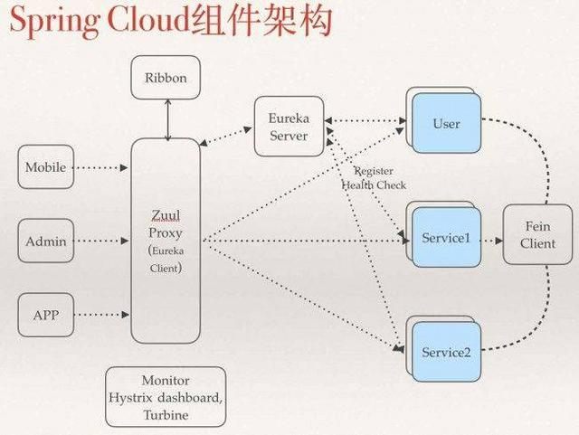

# 						Spring Boot

Spring boot 是 Spring 的一套快速配置脚手架，可以基于spring boot 快速开发单个微服务，Spring Boot，看名字就知道是Spring的引导，就是用于启动Spring的，使得Spring的学习和使用变得快速无痛。不仅适合替换原有的工程结构，更适合微服务开发。

Spring Cloud基于Spring Boot，为微服务体系开发中的架构问题，提供了一整套的解决方案——服务注册与发现，服务消费，服务保护与熔断，网关，分布式调用追踪，分布式配置管理等。

Spring Cloud是一个基于Spring Boot实现的云应用开发工具；Spring boot专注于快速、方便集成的单个个体，Spring Cloud是关注全局的服务治理框架；spring boot使用了默认大于配置的理念，很多集成方案已经帮你选择好了，能不配置就不配置，Spring Cloud很大的一部分是基于Spring boot来实现。

学过Spring的都知道，Spring开发有非常头疼的三点:

以启动一个带Hibernate的Spring MVC为例。
\1. 依赖太多了，而且要注意版本兼容。这个应用，要添加10-20个依赖，Spring相关的包10多个，然后是Hibernate包，Spring与Hibernate整合包，日志包，json包一堆，而且要注意版本兼容性。

\2. 配置太多了，要配置注解驱动，要配置数据库连接池，要配置Hibernate，要配置事务管理器，要配置Spring MVC的资源映射，要在web.xml中配置启动Spring和Spring MVC等

3.部署和运行麻烦。要部署到tomcat里面。不能直接用java命令运行。

太多重复和大家都一样的配置了。

Spring Boot的哲学就是约定大于配置。既然很多东西都是一样的，为什么还要去配置。

\1. 通过starter和依赖管理解决依赖问题。
\2. 通过自动配置，解决配置复杂问题。
\3. 通过内嵌web容器，由应用启动tomcat，而不是tomcat启动应用，来解决部署运行问题。

Spring Cloud体系就比较复杂了。基本可以理解为通过Spring Boot的三大魔法，将各种组件整合在一起，非常简单易用。

你可以把spring boot的官方的包分为两类，一种是为了搭建一个服务用的，比如hibernate jpa，比如 message。另外一种含有cloud关键字的，是为了各个spring boot之前管理和使用的包。

因为当把集群、CI等方法集中进来一起考虑的时候，这件事情就复杂了。

多个小有服务整合成的大服务，要有一个消息总线来用于互相通知和调用，要有一个服务发现程序来管理某个小服务上线可用，同时在服务离线时也要能处理，各个小服务要尽量各自独立，还要考虑服务的依赖性，集群的负载均衡，配置文件的分离。

再把CI和Docker拿进来一起考虑的话，更乱。

但我认为这样完成的一个服务是更具有可插拔性，更容易维护的。而且遵循了上面的cloud方案的话，在服务的健壮性上面也很强。

写到这里对于新接触的我认为可以先从单独的spring boot程序开始入门，当要添加一个新功能时，考虑拆分成另外服务。两个程序间可以通过 jmx或是 其它消息中间件或是rest通讯。最后实现了一个各自独立的功能集群。

总结一句：Spring boot可以离开Spring Cloud独立使用开发项目，但是Spring Cloud离不开Spring boot，属于依赖的关系。

