# 						Spring Cloud

# 1. 微服务发展史-架构的演变过程

**架构的演变过程:**

单体架构——>垂直架构——>soa面向服务架构——>微服务架构

**单体架构：**

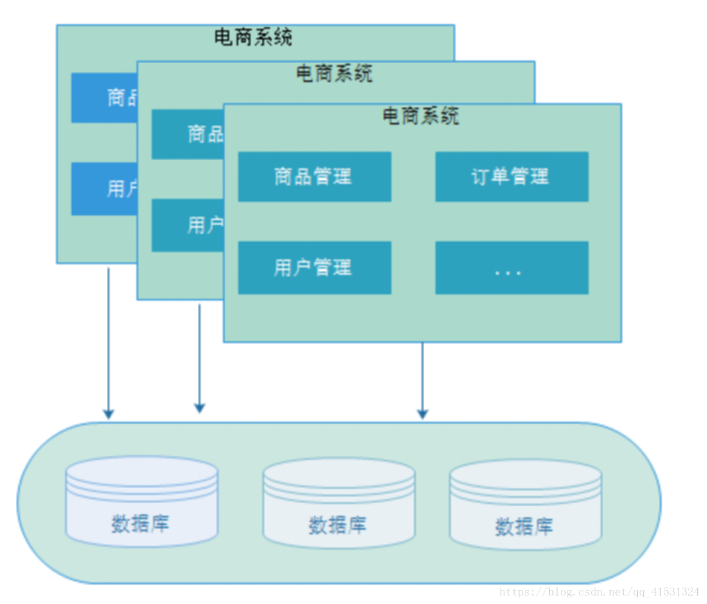

**特点：**

​    ①所有功能集中在一个项目中

​    ②所有功能都要打成war包部署到服务器

​    ③ 通过集群(session共享集群)来提高服务器的性能

**优点:**
    ①.项目架构简单,前期开发的成本低,周期短,小型企业首先.
**缺点:**
    ①全部的功能都集中在一个项目中完成,对于大型项目来说,开发难度高,不容易开发及扩展和维护.


**垂直架构**


特点:
    ①.以单体架构为单位进行系统的划分,划分成一个个系统.
    ②.项目与项目之间存在数据冗余,耦合度高.
    ③.项目是以接口调用为主,存在数据同步问题.
优点:
    ①.项目架构简单,前期开发的成本低,周期短,小型企业首先.
    ②.垂直架构进行mvc分层设计,针对分层做相应的处理做到集群(10~1000)
    ③.不同的项目采用不同的技术实现.
缺点:
    ①.全部的功能都集中在一个项目中完成,对于大型项目来说,开发难度高,不容易开发及扩展和维护.
    ②.集群扩展有瓶颈集群(10~1000)针对分层做了优化.

 

**SOA服务架构**

 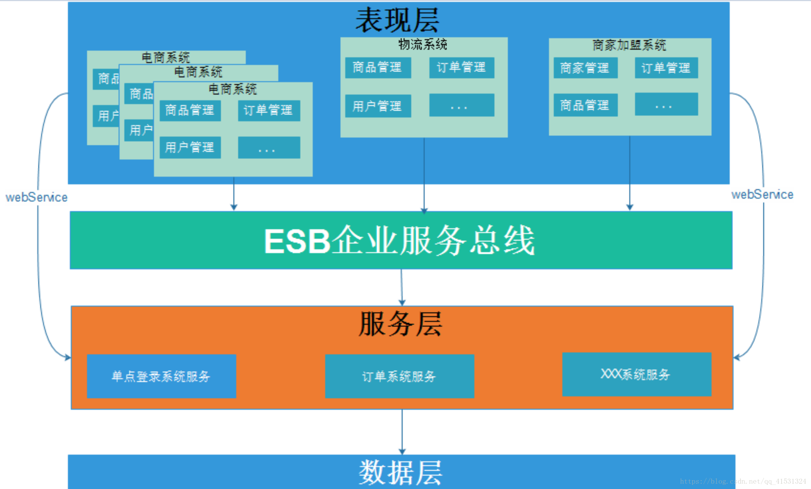

特点:
    ①.基于soa服务思想进行功能的抽取(重复代码问题解决),以服务为中心来管理项目.
    ②.各个系统之间要进行调用,所以出现ESB来管理项目(可以使用各种技术实现:webservice,rpc等)
    ③.ESB是作为系统与系统之间桥梁,很难进行统一管理.
优点:
    ①.重复代码进行了抽取,提高了开发效率,提高了系统的可维护性.
    ②.可以针对某个系统进行扩展,做集群更容易.
    ③.采用ESB来管理服务组件,有利于降低企业开发项目难度 
缺点:
    ①.系统与服务的界限模糊的,不利于设计.
    ②.ESB是作为系统与系统之间桥梁,没有统一标准,种类很多,不利于维护.

    抽取项目的粒度大,系统与服务之间解耦问题.

**微服务架构**

 

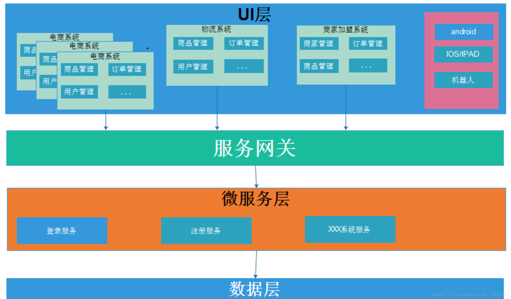

 

特点:
    ①.把系统的服务层完全独立出来,有利于资源的重复利用,提高开发效率.
    ②.微服务遵守单一原则
    ③.微服务与微服务之间的调用使用restful轻量级调用.
优点:
    ①.微服务拆分更细,有利于资源的重复利用,提高开发效率
    ②.可以更加精准针对某个服务做方案
    ③.微服务去中心化,使用restful轻量级通信协议比使用ESB企业服务总线更容易维护
    ④.适应市场更容易,产品迭代周期更短.
缺点:
    ①.微服务量多,服务治理成本高,不利于系统维护.
    分布式系统架构且是微服务架构,技术成本高(容错,分布式事务等),对团队高挑战.

# 2. Spring Cloud 及相关技术

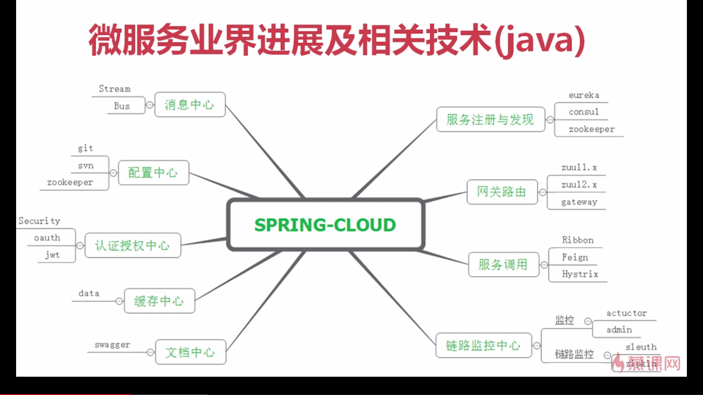


# 3. Spring API 网关


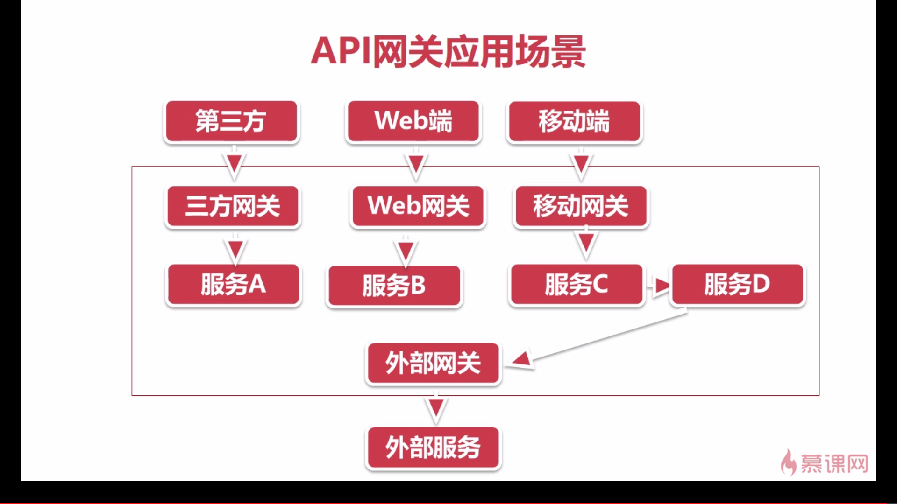

# 4.服务注册与发现Eureka 

在Spring Cloud里我们可以使用它的Eureka模块来实现服务注册与发现，Spring Cloud Eureka是基于Netflix Eureka做了二次封装，它主要负责完成各个微服务实例的自动化注册和发现功能。

Eureka由两个组件组成：

- Eureka Server（注册中心）

- Eureka Client （服务注册）

  Eureka服务治理体系如下：

  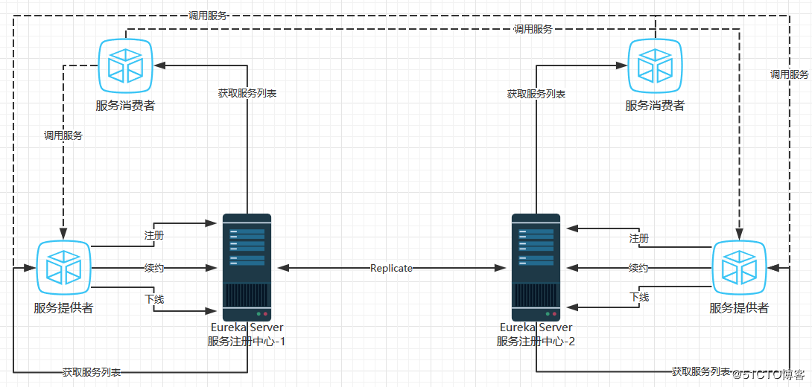

## 4.1 Eureka server 的使用

创建Eureka Server application， 引入eureka的依赖：

```
<dependency>
            <groupId>org.springframework.cloud</groupId>
            <artifactId>spring-cloud-starter-netflix-eureka-server</artifactId>
        </dependency>
```

项目创建好后，我们可以试着启动看看，但是在启动之前需要在启动类中加上`@EnableEurekaServer`注解，表示启用Eureka Server

注意： Eureka Server既是server的同时，也是一个client，它也是需要把自己注册到一个注册中心去的。如果没有配置注册中心的地址，所以它没办法注册自己就会报这个错误 ： Cannot execute request on any known server

既然如此，我们只需配置一下注册中心的地址即可，编辑application.yml配置文件内容如下

```yml
eureka:
  client:
    service-url:
      defaultZone: http://localhost:8761/eureka/  # 指定注册中心的url
    register-with-eureka: false  # 指定不进行注册操作，默认为true，若进行注册的话，会显示在Eureka信息面板上
  server:
    enable-self-preservation: false  # 禁用eureka server的自我保护机制，建议在生产环境下打开此配置
spring:
  application:
    name: eureka  # 指定应用的名称
server:
  port: 8761  # 指定项目的端口号
```

由于server和client是采用心跳机制来确认存活的，所以在启动项目的过程可能依旧会报错。但是只要启动后不是一直报错，并且能正常访问Eureka信息面板页面的话，则代表项目是在正常运行的

## 4.2 Eureka Client

创建eureka client 项目 引入依赖：

```
<dependency>
            <groupId>org.springframework.cloud</groupId>
            <artifactId>spring-cloud-starter-netflix-eureka-client</artifactId>
        </dependency>
```

项目的依赖都加载完成后，在启动类中加上@EnableEurekaClient`，声明这是一个eureka client，否则不会进行服务注册.

接着就是在application.yml配置文件中，配置注册中心即eureka server的地址，以及项目的名称和启动端口号。如下：

```yml
eureka:
  client:
    service-url:
      defaultZone: http://localhost:8761/eureka/
spring:
  application:
    name: eureka-client
server:
  port: 9088
```

## 4.3 Eureka的高可用

高可用是在服务架构设计中，频繁出现的词汇。微服务架构里自然也一样需要保证服务的高可用性.

在实际生产环境中服务器是很脆弱的，单台服务器肯定是无法满足高可用的需求，为了保证高可用性我们通常会准备多台服务器。但可以发现上文中所搭建的eureka server是单机的，若这个eureka server宕机，则会导致与之关联的全部微服务发生故障。

既然单机无法保证高可用，那么我们就加多一台机器好了，然后让这两个eureka server互相进行关联。例如我现在有两台eureka server。一台名叫eureka-server01跑在8761端口上，另一台名叫eureka-server02跑在8762端口上。然后只需要两个步骤即可实现高可用：

- 1.编辑这两台eureka server的配置文件，让它们的注册地址互相指向，即可关联在一起
- 2.在eureka client的配置文件中，配置上这两台eureka server的地址，让client能够同时注册到这两台eureka server上。这样即便其中一台eureka server挂掉，另一台依旧可以继续工作

1.编辑两台eureka server的配置文件，

eureka-server01：

```yml
eureka:
  client:
    service-url:
      defaultZone: http://localhost:8762/eureka/  # 指向eureka-server02的url
    register-with-eureka: false
  server:
    enable-self-preservation: false 
spring:
  application:
    name: eureka-server01 
server:
  port: 8761
```

eureka-server02：

```yml
eureka:
  client:
    service-url:
      defaultZone: http://localhost:8761/eureka/  # 指向eureka-server01的url
    register-with-eureka: false
  server:
    enable-self-preservation: false
spring:
  application:
    name: eureka-server02 
server:
  port: 8762 
```

2.编辑eureka client的配置文件，多个url使用英文逗号分隔：

```yml
eureka:
  client:
    service-url:
      defaultZone: http://localhost:8761/eureka/,http://localhost:8762/eureka/
spring:
  application:
    name: eureka-client
server:
  port: 9088
```

如果项目规模比较大，有两个以上的eureka server，那该如何在配置文件中配置呢？其实只需要每台eureka server分别配置除自己之外的eureka server机器，然后eureka client则配置所有的eureka server地址即可。如下图：

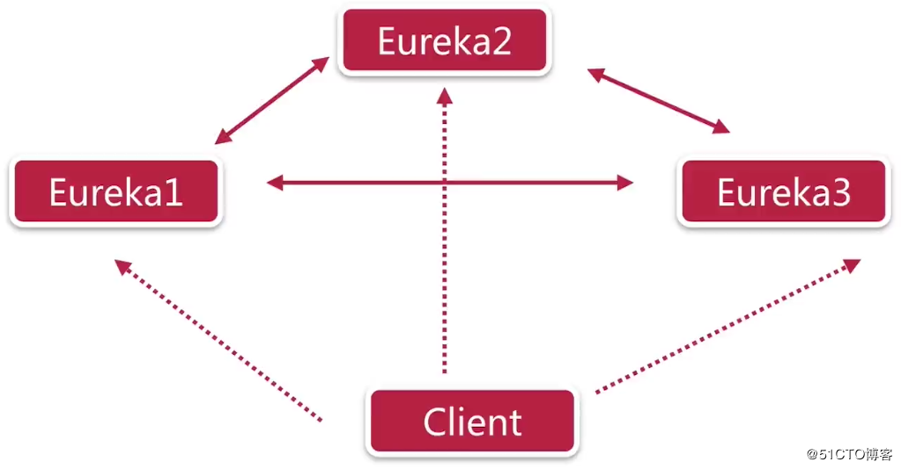


# 5. Ribbon

在`SpringCloud`体系中，我们知道服务之间的调用是通过`http`协议进行调用的。而注册中心的主要目的就是维护这些服务的服务列表。我们知道，在`Spring`中，提供了`RestTemplate`。`RestTemplate`是`Spring`提供的用于访问Rest服务的客户端。而在`SpringCloud`中也是使用此服务进行服务调用的。

同时在微服务中，一般上服务都不会进行单点部署的，都会至少部署2台及以上的。现在我们有了注册中心进行服务列表的维护，就需要一个客户端负载均衡来进行动态服务的调用。

## 5.1 何为负载均衡

负载均衡(Load Balance)是分布式系统架构设计中必须考虑的因素之一，它通常是指，将请求/数据**【均匀】分摊**到多个操作单元上执行，负载均衡的关键在于【均匀】。

1.HTTP重定向负载均衡

根据用户的http请求计算出一个真实的web服务器地址，并将该web服务器地址写入http重定向响应中返回给浏览器，由浏览器重新进行访问

**优缺点：实现起来很简单，而缺点也显而易见了：请求两次才能完成一次访问；性能差;重定向服务器会成为瓶颈**

2.DNS域名解析负载均衡

在DNS服务器上配置多个域名对应IP的记录。例如一个域名`www.baidu.com`对应一组web服务器IP地址，域名解析时经过DNS服务器的算法将一个域名请求分配到合适的真实服务器上。

**优缺点：加快访问速度,改善性能。同时由于DNS解析是多级解析，每一级DNS都可能化缓存记录A，当某一服务器下线后，该服务器对应的DNS记录A可能仍然存在，导致分配到该服务器的用户访问失败，而且DNS负载均衡采用的是简单的轮询算法，不能区分服务器之间的差异，不能反映服务器当前运行状态。**

3.反向代理负载均衡

反向代理处于web服务器这边，反向代理服务器提供负载均衡的功能，同时管理一组web服务器，它根据负载均衡算法将请求的浏览器访问转发到不同的web服务器处理，处理结果经过反向服务器返回给浏览器。

**优缺点：实现简单，可利用反向代理缓存资源(这是最常用的了)及改善网站性能。同时因为是所有请求和响应的中转站，所以反向代理服务器可能成为瓶颈。**

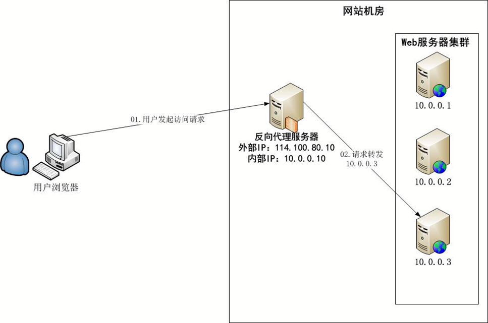


## 5.2 客户端和服务端的负载均衡

实现负载均衡也又区分客户端和服务端之分，`Ribbon`就是基于客户端的负载均衡。 

**客户端负载均衡：**

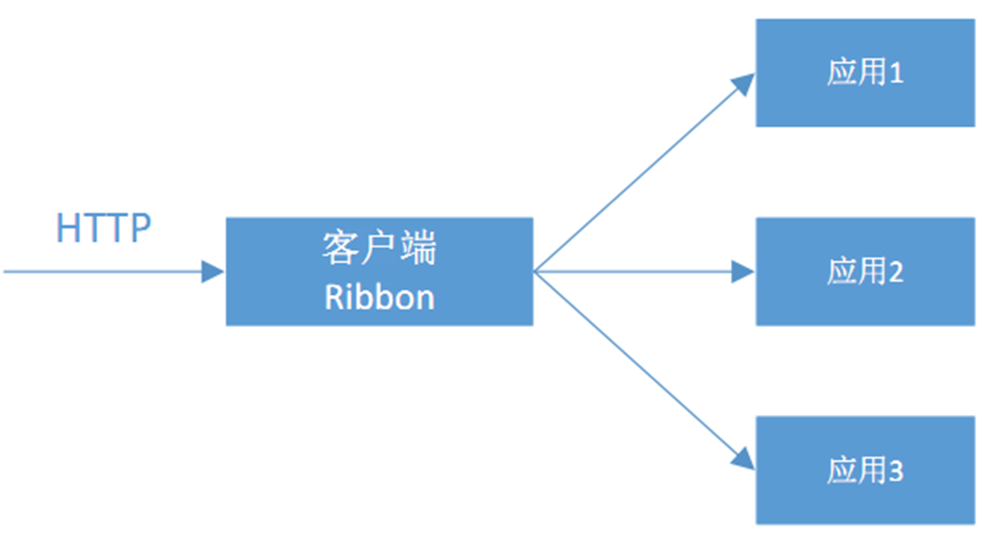

**服务端负载均衡：**

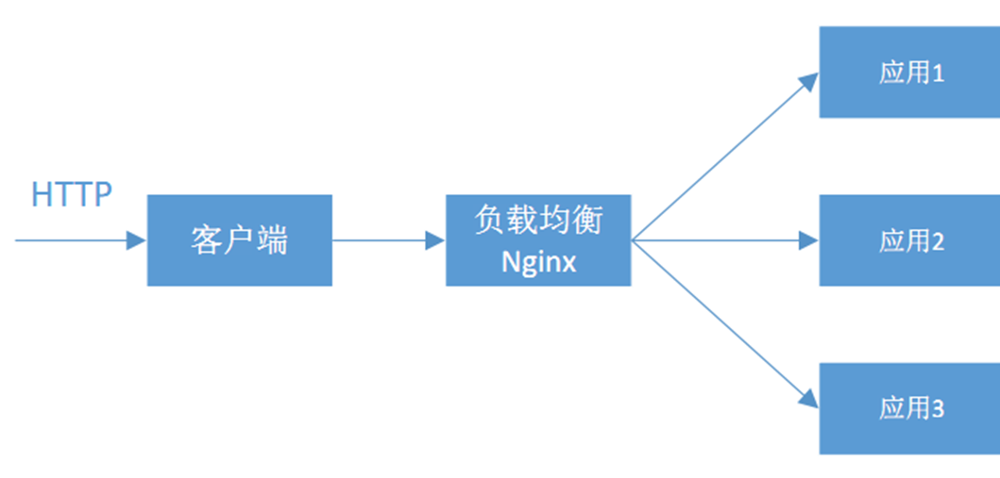

## 5.3 RestTemplate简单介绍

`RestTemplate`是`Spring`提供的用于访问`Rest服务`的客户端，`RestTemplate`提供了多种便捷访问远程Http服务的方法，能够大大提高客户端的编写效率。

简单来说，`RestTemplate`采用了`模版设计`的设计模式，将过程中与特定实现相关的部分委托给接口,而这个接口的不同实现定义了接口的不同行为,所以可以很容易的使用不同的第三方http服务，如`okHttp`、`httpclient`等。

`RestTemplate`定义了很多的与REST资源交互

## 5.4 客户端负载均衡Ribbon实例

`Spring Cloud Ribbon`是一个基于Http和TCP的客服端负载均衡工具，它是基于`Netflix Ribbon`实现的。与`Eureka`配合使用时，`Ribbon`可自动从`Eureka Server (注册中心)`获取服务提供者地址列表，并基于`负载均衡`算法，通过在客户端中配置`ribbonServerList`来设置服务端列表去轮询访问以达到均衡负载的作用

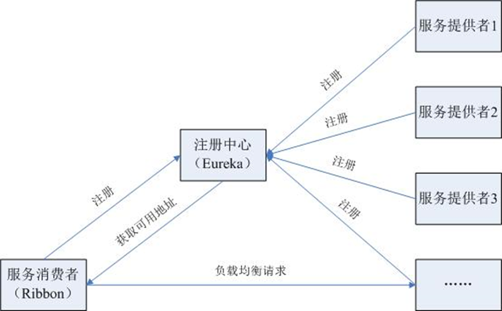

## 5.5 LoadBalanced注解

```java
@Bean
@LoadBalanced
public RestTemplate restTemplate(RestTemplateBuilder builder) {
    // Do any additional configuration here
    return builder.build();
}
```

`@LoadBalanced`注解修饰`RestTemplate`bean类，就实现了服务的调用

首先，此类生效的条件是

- `RestTemplate`类必须存在于当前工程的环境中。
- 在Spring的Bean工程中有必须有`LoadBalancerClient`的实现Bean。

该自动化配置类中，主要做了几件事情：

- 维护了一个被@LoadBalanced注解修饰的RestTemplate对象列表

**总体来说，就是通过为加入@LoadBalanced注解的RestTemplate添加一个请求拦截器，在请求前通过拦截器获取真正的请求地址，最后进行服务调用。**

## 5.6 负载均衡器

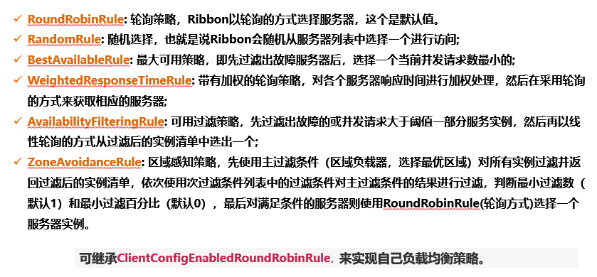

## 5.7  使用java 代码自定义Ribbon 配置

## 5.8， 使用属性自定义Ribbon配置

## 5.9, 脱离Eureka使用Ribbon


# 6. 使用Feign实现声明式REST调用

`Feign`是`Netflix`开发的声明式、模块化的HTTP客户端。`Feign`可帮助我们更好更快的便捷、优雅地调用`HTTP API`。

在`Spring Cloud`中，使用`Feign`非常简单——创建一个接口，并在接口上添加一些注解。`Feign`支持多种注释，例如Feign自带的注解或者JAX-RS注解等 Spring Cloud对Feign进行了增强，使Feign支持了Spring MVC注解，并整合了Ribbon和 Eureka,从而让Feign 的使用更加方便。**只需要通过创建接口并用注解来配置它既可完成对Web服务接口的绑定。**


Feign是一个声明式的Web Service客户端，它的目的就是让Web Service调用更加简单。Feign提供了HTTP请求的模板，通过编写简单的接口和插入注解，就可以定义好HTTP请求的参数、格式、地址等信息。

而Feign则会完全代理HTTP请求，我们只需要像调用方法一样调用它就可以完成服务请求及相关处理。Feign整合了Ribbon和Hystrix(关于Hystrix我们后面再讲)，可以让我们不再需要显式地使用这两个组件。

总结起来说，Feign具有如下特性：

- 可插拔的注解支持，包括Feign注解和JAX-RS注解;
- 支持可插拔的HTTP编码器和解码器;
- 支持Hystrix和它的Fallback;
- 支持Ribbon的负载均衡;
- 支持HTTP请求和响应的压缩。

这看起来有点像我们springmvc模式的Controller层的RequestMapping映射。这种模式是我们非常喜欢的。Feign是用@FeignClient来映射服务的。


- 当重试次数大于默认次数5时候，直接抛出异常，不在重试
- ​       否则每隔一段时间 默认值最大1ms 后重试一次。


**Feign负载均衡策略**

Feign负载均衡还是通过Ribbon实现的，

Ribbon和Hystrix一样都是利用了rxjava


```
BaseLoadBalancer采用的规则为RoundRobinRule 轮训规则
DynamicServerListLoadBalancer继承了BaseLoadBalancer，主要运行时改变Server列表
NoOpLoadBalancer 什么操作都不做
ZoneAwareLoadBalancer 功能主要是根据区域Zone分组的实例列表
```

### Feign继承特性

`Feign`支持继承，**但不支持多继承**。使用继承，可将一些公共操作分组到一些父类接口中，从而简化Feign的开发。

**所以在实际开发中，调用服务接口时，可直接按接口类和实现类进行编写，调用方引入接口依赖，继承一个本地接口，这样接口方法默认都是定义好的，也少了很多编码量。用起来就更爽了，就是有点依赖性，对方服务修改后需要同步更新下，但这个团队内部约定下问题不大的**

# 7. Hystrix 实现微服务的容错处理

我们知道大量请求会阻塞在Tomcat服务器上,影响其它整个服务.在复杂的分布式架构的应用程序有很多的依赖,都会不可避免地在某些时候失败.高并发的依赖失败时如果没有隔离措施,当前应用服务就有被拖垮的风险.
Spring Cloud Netflix Hystrix就是隔离措施的一种实现,可以设置在某种超时或者失败情形下断开依赖调用或者返回指定逻辑,从而提高分布式系统的稳定性.

Hystrix 如果它在一段时间内侦测到许多类似的错误，会强迫其以后的多个调用快速失败，不再访问远程服务器，从而防止应用程序不断地尝试执行可能会失败的操作进而导致资源耗尽。这时候Hystrix进行FallBack操作来服务降级，Fallback相当于是降级操作. 对于查询操作, 我们可以实现一个fallback方法, 当请求后端服务出现异常的时候, 可以使用fallback方法返回的值. fallback方法的返回值一般是设置的默认值或者来自缓存.通知后面的请求告知这服务暂时不可用了。

使得应用程序继续执行而不用等待修正错误，或者浪费CPU时间去等到长时间的超时产生。Hystrix熔断器也可以使应用程序能够诊断错误是否已经修正，如果已经修正，应用程序会再次尝试调用操作。

## 7.1 Hystrix特性

1.请求熔断： 当Hystrix Command请求后端服务失败数量超过一定比例(默认50%), 断路器会切换到开路状态(Open). 这时所有请求会直接失败而不会发送到后端服务. 断路器保持在开路状态一段时间后(默认5秒), 自动切换到半开路状态(HALF-OPEN).

　　　 这时会判断下一次请求的返回情况, 如果请求成功, 断路器切回闭路状态(CLOSED), 否则重新切换到开路状态(OPEN). Hystrix的断路器就像我们家庭电路中的保险丝, 一旦后端服务不可用, 断路器会直接切断请求链, 避免发送大量无效请求影响系统吞吐量, 并且断路器有自我检测并恢复的能力.

　　2.服务降级：Fallback相当于是降级操作. 对于查询操作, 我们可以实现一个fallback方法, 当请求后端服务出现异常的时候, 可以使用fallback方法返回的值. fallback方法的返回值一般是设置的默认值或者来自缓存.告知后面的请求服务不可用了，不要再来了。

　　3.依赖隔离(采用舱壁模式，Docker就是舱壁模式的一种)：在Hystrix中, 主要通过线程池来实现资源隔离. 通常在使用的时候我们会根据调用的远程服务划分出多个线程池.比如说，一个服务调用两外两个服务，你如果调用两个服务都用一个线程池，那么如果一个服务卡在哪里，资源没被释放

　　　后面的请求又来了，导致后面的请求都卡在哪里等待，导致你依赖的A服务把你卡在哪里，耗尽了资源，也导致了你另外一个B服务也不可用了。这时如果依赖隔离，某一个服务调用A B两个服务，如果这时我有100个线程可用，我给A服务分配50个，给B服务分配50个，这样就算A服务挂了，

　　　我的B服务依然可以用。

　　4.请求缓存：比如一个请求过来请求我userId=1的数据，你后面的请求也过来请求同样的数据，这时我不会继续走原来的那条请求链路了，而是把第一次请求缓存过了，把第一次的请求结果返回给后面的请求。

　　5.请求合并：我依赖于某一个服务，我要调用N次，比如说查数据库的时候，我发了N条请求发了N条SQL然后拿到一堆结果，这时候我们可以把多个请求合并成一个请求，发送一个查询多条数据的SQL的请求，这样我们只需查询一次数据库，提升了效率。

**Hystrixl流程图如下：**

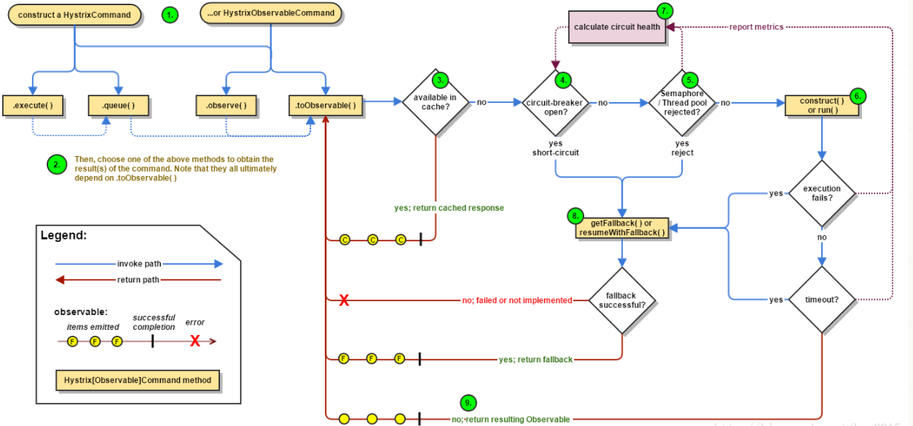

**Hystrix流程说明:**

 

   　1:每次调用创建一个新的HystrixCommand,把依赖调用封装在run()方法中.
　　2:执行execute()/queue做同步或异步调用.
　　4:判断熔断器(circuit-breaker)是否打开,如果打开跳到步骤8,进行降级策略,如果关闭进入步骤5.
　　5:判断线程池/队列/信号量是否跑满，如果跑满进入降级步骤8,否则继续后续步骤6.
　　6:调用HystrixCommand的run方法.运行依赖逻辑
　　6a:依赖逻辑调用超时,进入步骤8.
　　7:判断逻辑是否调用成功
　　7a:返回成功调用结果
　　7b:调用出错，进入步骤8.
　　8:计算熔断器状态,所有的运行状态(成功, 失败, 拒绝,超时)上报给熔断器，用于统计从而判断熔断器状态.
　　9:getFallback()降级逻辑.以下四种情况将触发getFallback调用：
　　　　(1):run()方法抛出非HystrixBadRequestException异常。
　　　　(2):run()方法调用超时
　　　　(3):熔断器开启拦截调用
　　　　(4):线程池/队列/信号量是否跑满
　　9a:没有实现getFallback的Command将直接抛出异常
　　9b:fallback降级逻辑调用成功直接返回
　　9c:降级逻辑调用失败抛出异常
　　10:返回执行成功结果

这里接着前面的Ribbon进行Hystrix集成。说白了你想对一个请求进行熔断，必然不能让客户直接去调用那个请求，你必然要要对别人的请求进行包装一层和拦截，才能做点手脚，比如进行熔断，所以说要在Ribbon上动手脚。因为它是请求发起的地方。

我们刚开始请求一个服务，为了负载均衡进行了拦截一次，现在我们要进行熔断，所以必须跟Ribbon集成一次，再进行请求拦截来熔断。

步骤：

1. 引入依赖：特别需要注意的是， spring boot 2.0 需要引入hystrix-javanica 依赖

```java
<dependency>
    <groupId>org.springframework.cloud</groupId>actuator
    <artifactId>spring-cloud-starter-hystrix</artifactId>
</dependency>
<dependency>
    <groupId>com.netflix.hystrix</groupId>
    <artifactId>hystrix-javanica</artifactId>
    <version>RELEASE</version>
</dependency>
```

2.在启动类中加入@EnableCircuitBreaker注解，表示允许断路器

```java
@SpringBootApplication
@EnableEurekaClient
@EnableCircuitBreaker
public class MicroserviceMovieHystrixApplication {

    public static void main(String[] args) {
        SpringApplication.run(MicroserviceMovieHystrixApplication.class, args);
    }

    @Bean
    @LoadBalanced
    public RestTemplate restTemplate(RestTemplateBuilder builder) {
        // Do any additional configuration here
        return builder.build();
    }
}
```

3. 在controller类中配置Hystrix Command 和fallback方法

```java
@GetMapping("/movie/{id}")
@HystrixCommand(fallbackMethod = "findByIdFallback")
public User findById(@PathVariable Long id ) {
    return this.restTemplate.getForObject(userServicePath + id , User.class);
}

public User findByIdFallback(Long id) {
    User user  = new User();
    user.setId(0L);
    return user;
}
```

4. 手动实现服务降级：

   这里进入注解@HystrixCommand(fallbackMethod = "findByIdFallback")的背后原理来实现熔断和服务降级。用我们自己手写的代码去实现熔断和服务降级。那么Hystrix给我们留下了什么样的接口呢？可以让我们自己手动更灵活的去实现熔断和服务降级。

   Hystrix给我们提供了HystrixCommand类，让我们去继承它，去实现灵活的熔断和服务降级。

## 7.2 Feign 使用Hystrix

1. @FeignClient 配置服务fallback指定的class

```java
@FeignClient(name = "microservice-provider-user",  fallback = FeignClientFallback.class)
public interface UserFeignClient {
    @RequestMapping(value = "/simple/{id}", method = RequestMethod.GET)
    public User findById(@PathVariable("id") Long id );

    @RequestMapping(value = "/user", method = RequestMethod.POST)
    public User postUser(User user);

    @RequestMapping(value = "/user", method = RequestMethod.GET)
    public User getUser(User user);
}
```

2. 定义fallback 的具体实现类， 继承了feign接口

```java
@Component
public class FeignClientFallback implements UserFeignClient {
    @Override
    public User findById(Long id) {
        User user = new User();
        user.setId(0L);
        user.setUsername("default user");
        return user;
    }

    @Override
    public User postUser(User user) {
        return null;
    }

    @Override
    public User getUser(User user) {
        return null;
    }
}
```

3.  启动eureka 和 provider， 和feignwithHystrix ，测试

## 7.3 为feign 禁用Hystrix